# 第一行代码 基于Android API18
##  第一章 安卓介绍
### 1. 安卓系统架构
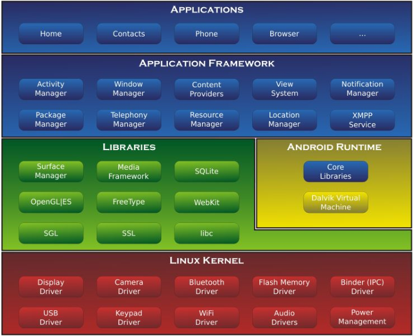
#### 1.1 Linux 内核层
&emsp;&emsp;Android 系统是基于内核的，这一层为 Android 设备的各种硬件提供了底层的驱动，如显示驱动、音频驱动、照相机驱动、蓝牙驱动、Wi-Fi 驱动、电源管理等。

#### 1.2 系统运行库层
&emsp;&emsp;这一层通过一些 C/C++库来为 Android 系统提供了主要的特性支持。如 SQLite 库提供了数据库的支持，OpenGL|ES 库提供了 3D 绘图的支持，Webkit 库提供了浏览器内核的支持等。

&emsp;&emsp;同样在这一层还有 Android 运行时库，它主要提供了一些核心库，能够允许开发者使用 Java 语言来编写 Android 应用。另外 Android 运行时库中还包含了 Dalvik 虚拟机，它使得每一个 Android 应用都能运行在独立的进程当中，并且拥有一个自己的 Dalvik 虚拟机实例。相较于 Java 虚拟机，Dalvik 是专门为移动设备定制的，它针对手机内存、CPU 性能有限等情况做了优化处理

#### 1.3 应用框架层

&emsp;&emsp;这一层主要提供了构建应用程序时可能用到的各种 API，Android 自带的一些核心应用就是使用这些API完成的，开发者也可以通过使用这些API来构建自己的应用程序。

#### 1.4 应用层

&emsp;&emsp;所有安装在手机上的应用程序都是属于这一层的，比如系统自带的联系人、短信等程序，或者是你从 Google Play 上下载的小游戏，当然还包括你自己开发的程序。

## 第二章 四大组件之Activity

### 1. activity介绍

    活动是一种可以包含用户界面的组件，主要用于和用户进行交互。

### 2. 活动的基本用法

####     2.1 创建活动

&emsp;&emsp;Android 程序的设计讲究逻辑和视图分离，最好每一个活动都能对应一
个布局，布局就是用来显示界面内容的。

&emsp;&emsp;编程时创建类继承Acitivity，重写onCreate()方法并在方法中 ==使用setContentView()加载xml布局文件== 作为界面，每一个创建的 ==Activity都需要在Androidmanifest文件中进行声明== 。

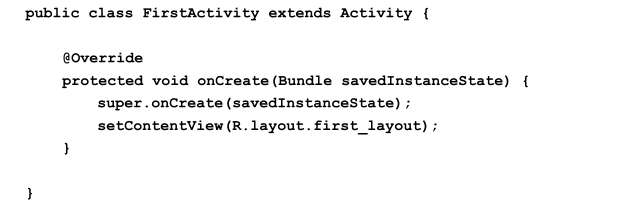

###### a.创建activity的Java代码


###### b.布局文件xml

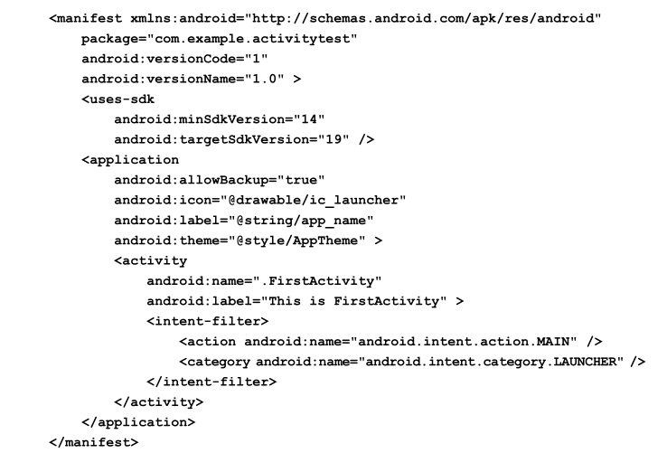

###### c.注册activity


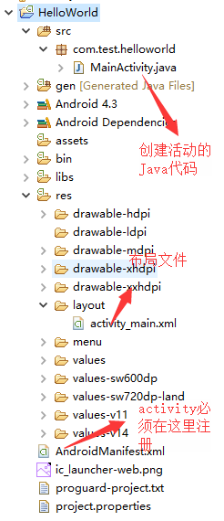


###### d.项目目录结构


#### 2.2 隐藏标题栏

在activity的onCreate()方法中的setContentView()之前调用requestWindowFeature(Window.FEATURE_NO_TITLE)

#### 2.3 在活动使用Toast

&emsp;&emsp;Toast 是 Android 系统提供的一种非常好的提醒方式，在程序中可以使用它将一些短小的信息通知给用户，这些信息会在一段时间后自动消失，并且不会占用任何屏幕空间（次数使用按钮的onclick时来出发Toast）

~~~java
protected void onCreate(Bundle savedInstanceState) {
	super.onCreate(savedInstanceState);
    // 隐藏标题栏
	requestWindowFeature(Window.FEATURE_NO_TITLE);
    // 设置布局
	setContentView(R.layout.first_layout);
    // 创建按钮
	Button button1 = (Button) findViewById(R.id.button_1);
    // 为按钮绑定事件
	button1.setOnClickListener(new OnClickListener() {
        @Override
        public void onClick(View v) {		// 重写方法 此处为按钮点击后具体的处理逻辑
            Toast.makeText(FirstActivity.this, "You clicked Button 1",
                Toast.LENGTH_SHORT).show(); 
            // 显示Toast，一定要调用show()方法，否则Toast不显示
        }
	});
}
~~~


#### 2.4 在活动中使用menu

&emsp;&emsp;首先在res下创建menu文件夹，同activity一样，menu也是使用xml来布局的，只是存放的目录不同而已.

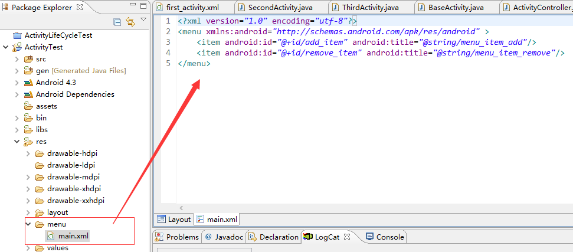

&emsp;&emsp;menus文件创建好之后，需要在activity中通过重写onCreateOptionsMenu()方法加载布局，代码如下

~~~ java
@Override
	public boolean onCreateOptionsMenu(Menu menu) {
		// 创建菜单 参数一：菜单文件 参数二：菜单要添加到哪个对象上
		getMenuInflater().inflate(R.menu.main, menu);
		return true;
	}
~~~

#### 2.5 销毁活动

&emsp;&emsp;当想要结束当前活动时可以使用activity的finish()方法结束活动。

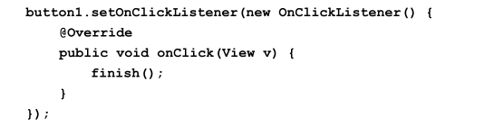

###### <center>点击按钮关闭活动</center>

### 3. 使用intent实现活动之间的跳转与数据传输

#### 3.1 显示intent

> 显示intent就是指定了原activity和目标activity在活动之间跳转

```JAVA
button1.setOnClickListener(new OnClickListener() {
    @Override
    public void onClick(View v) {
        // 创建activity
        Intent intent = new Intent(FirstActivity.this, SecondActivity.class);
       	// 跳转
        startActivity(intent);
    }
});
```

注：使用前需先创建好相应的activity，并==在manifest文件中注册activity==

#### 3.2 隐式intent

> 隐式intent是创建intent时指定intent的action和category，只要action和category与intent都匹配的活动都可以进行跳转

&emsp;&emsp;使用前先修改manifest文件中activity，添加action和category

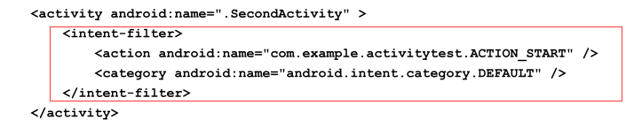

```java
button1.setOnClickListener(new OnClickListener() {
    @Override
    public void onClick(View v) {
        Intent intent = new Intent("com.example.activitytest.ACTION_START");
        // 默认会添加此category
     	// intent.addCategory("android.intent.category.DEFAULT");
       
        // intent.addCategory("com.huae.activitytest.MY_CATEGORY"); 添加自定义category
        startActivity(intent);
    }
});
```

**==注==:**
&emsp;**1.** intent会默认添加 `android:name="android.intent.category.DEFAULT`
&emsp;**2.** 可以使用intent通过添加不同的category实现不同程序之间的跳转
&emsp;&emsp;例：使用intent打开网页 此时能响应该intent的活动必须 action、 category(此处为默认categoriy)、Data同时匹配。

```java
button1.setOnClickListener(new OnClickListener() {
    @Override
    public void onClick(View v) {
        Intent intent = new Intent(Intent.ACTION_VIEW);
        intent.setData(Uri.parse("http://www.baidu.com"));
        startActivity(intent);
    }
});
```

#### 3.3 使用intent在activity间传送数据

##### 3.3.1 传递数据给下一个活动

&emsp;&emsp;使用intent的putExtra()方法添加数据可以传递个下一个活动、

&emsp;&emsp;**传送数据:**

~~~ java
button1.setOnClickListener(new OnClickListener() {
    @Override
    public void onClick(View v) {
        String data = "Hello SecondActivity";
        Intent intent = new Intent(FirstActivity.this, SecondActivity.class);
        intent.putExtra("extra_data", data);
        startActivity(intent);
    }
});
~~~

**接收数据:**

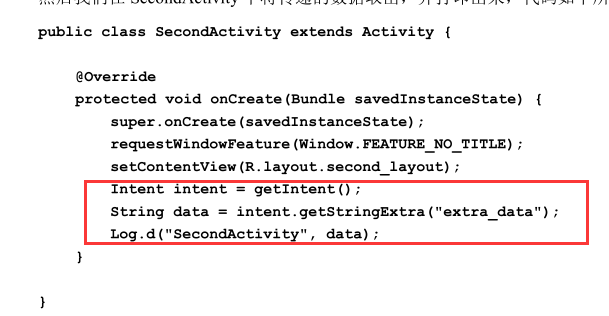

##### 3.3.2 返回数据给上一个活动

 &emsp;&emsp;==startActivityForResult()==方法也是用于启动活动的，但这个方法期望在活动销毁的时候能够返回一个结果给上一个活动，startActivityForResult()方法接收两个参数，第一个参数还是 Intent，第二个参数是请求
码，用于在之后的回调中判断数据的来源。

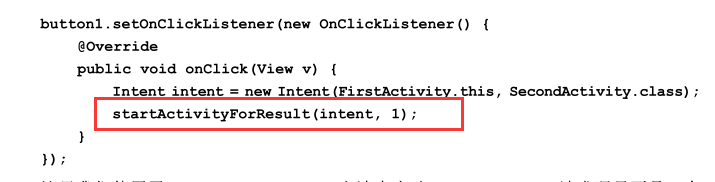

SecondActivity响应数据

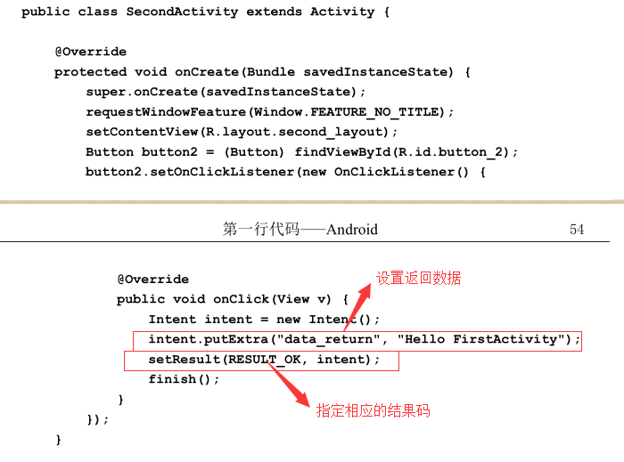

FirstActivity数据返回结果

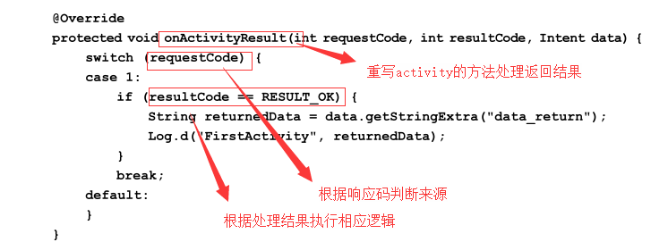

&emsp;&emsp;`onActivityResult()`方法带有三个参数，第一个参数 `requestCode`，即我们在启动活动时传入的请求码。第二个参数` resultCode`，即我们在返回数据时传入的处理结果。第三个参数`data`，即携带着返回数据的 Intent。由于在一个活动中有可能调用 `startActivityForResult()`方法去启动很多不同的活动，每一个活动返回的数据都会回调到 `onActivityResult()`这个方法中，因此我们首先要做的就是通过检查` requestCode` 的值来判断数据来源。确定数据是从SecondActivity 返回的之后，我们再通过 `resultCode` 的值来判断处理结果是否成功。最后从data中取值并打印出来，这样就完成了向上一个活动返回数据的工作。

##### 3.3.3 使用back键返回时 数据返回给上一个活动

&emsp;&emsp;只需重写activity的` onBackPressed()`的方法,加入相应的处理逻辑即可

```Java
@Override
public void onBackPressed() {
    Intent intent = new Intent();
    intent.putExtra("data_return", "Hello FirstActivity");
    setResult(RESULT_OK, intent);
    finish();
}
```

### 4. 活动的生命周期

#### 4.1 返回栈

>	Android 是使用任务（Task）来管理活动的，一个任务就是一组存放在栈里的活动的集合，这个栈也被称作返回栈（Back Stack）。在默认情况下，每当我们启动了一个新的活动，它会在返回栈中入栈，并处于栈顶的位置。而每当我们按下 Back 键或调用 finish()方法去销毁一个活动时，处于栈顶的活动会出栈，这时前一个入栈的活动就会重新处于栈顶的位置。系统总是会显示处于栈顶的活动给用户。

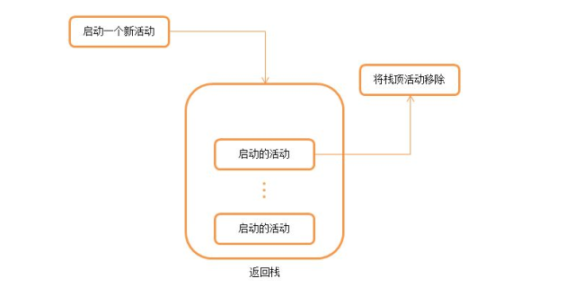

#### 4.2 活动的状态

每个活动在其生命周期中最多可能会有四种状态。
1. ==**运行状态**==
    &emsp;&emsp;当一个活动位于返回栈的栈顶时，这时活动就处于运行状态。系统最不愿意回收的
    就是处于运行状态的活动，因为这会带来非常差的用户体验。
2. ==**暂停状态**==
    &emsp;&emsp;当一个活动不再处于栈顶位置，但仍然可见时，这时活动就进入了暂停状态。你可
    能会觉得既然活动已经不在栈顶了，还怎么会可见呢？这是因为并不是每一个活动都会
    占满整个屏幕的，比如对话框形式的活动只会占用屏幕中间的部分区域，你很快就会在
    后面看到这种活动。处于暂停状态的活动仍然是完全存活着的，系统也不愿意去回收这
    种活动（因为它还是可见的，回收可见的东西都会在用户体验方面有不好的影响），只
    有在内存极低的情况下，系统才会去考虑回收这种活动。
3. ==**停止状态**==
    &emsp;&emsp;当一个活动不再处于栈顶位置，并且完全不可见的时候，就进入了停止状态。系统
    仍然会为这种活动保存相应的状态和成员变量，但是这并不是完全可靠的，当其他地方
    需要内存时，处于停止状态的活动有可能会被系统回收。
4. ==**销毁状态**==
    &emsp;&emsp;当一个活动从返回栈中移除后就变成了销毁状态。系统会最倾向于回收处于这种状
    态的活动，从而保证手机的内存充足。

#### 4.3 活动的生命周期
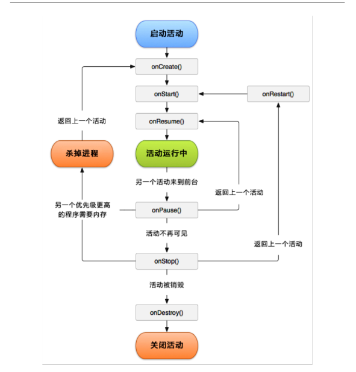
######<center>活动生命周期图</center>

Activity 类中定义了七个回调方法，覆盖了活动生命周期的每一个环节。
1. ==**onCreate()**==
    这个方法你已经看到过很多次了，每个活动中我们都重写了这个方法，它会在活动
    第一次被创建的时候调用。你应该在这个方法中完成活动的初始化操作，比如说加载布
    局、绑定事件等。
2. ==**onStart()**==
    这个方法在活动由不可见变为可见的时候调用。
3. ==**onResume()**==
    这个方法在活动准备好和用户进行交互的时候调用。此时的活动一定位于返回栈的
    栈顶，并且处于运行状态。
4. ==**onPause()**==
    这个方法在系统准备去启动或者恢复另一个活动的时候调用。我们通常会在这个方
    法中将一些消耗 CPU 的资源释放掉，以及保存一些关键数据，但这个方法的执行速度
    一定要快，不然会影响到新的栈顶活动的使用。
5. ==**onStop()**==
    这个方法在活动完全不可见的时候调用。它和 onPause()方法的主要区别在于，如
    果启动的新活动是一个对话框式的活动，那么 onPause()方法会得到执行，而 onStop()
    方法并不会执行。
6. ==**onDestroy()**==
    这个方法在活动被销毁之前调用，之后活动的状态将变为销毁状态。
7. ==**onRestart()**==
    这个方法在活动由停止状态变为运行状态之前调用，也就是活动被重新启动了。


&emsp;&emsp;以上七个方法中除了 onRestart()方法，其他都是两两相对的，从而又可以将活动分为三种生存期。

1. ==**完整生存期**==
    活动在 onCreate()方法和 onDestroy()方法之间所经历的，就是完整生存期。一般情
    况下，一个活动会在 onCreate()方法中完成各种初始化操作，而在 onDestroy()方法中完
    成释放内存的操作。

2. ==**可见生存期**==
    活动在 onStart()方法和 onStop()方法之间所经历的，就是可见生存期。在可见生存
    期内，活动对于用户总是可见的，即便有可能无法和用户进行交互。我们可以通过这两
    个方法，合理地管理那些对用户可见的资源。比如在 onStart()方法中对资源进行加载，
    而在onStop()方法中对资源进行释放，从而保证处于停止状态的活动不会占用过多内存。

3. ==**前台生存期**==
    活动在 onResume()方法和 onPause()方法之间所经历的，就是前台生存期。在前台
    生存期内，活动总是处于运行状态的，此时的活动是可以和用户进行相互的，我们平时
    看到和接触最多的也这个状态下的活动。


&emsp;&emsp;**当活动被系统回收时，通过重写`onSaveInstanceState(Bundle outState)`方法保存当前活动中需要保存的一些数据，该方法会在销毁activity之前执行。  然后在activity恢复时通过` onCreate() `方法的参数==savedInstanceState== 获取保存的数据。**

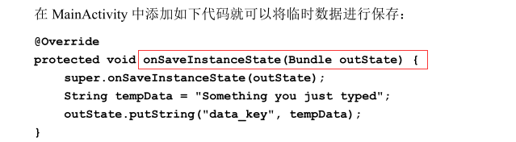

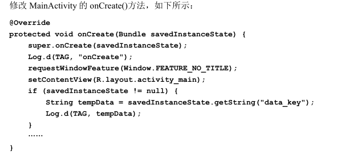

### 5. 活动的启动模式

> 活动的启动模式值得是活动的实例在栈中的存放、创建、销毁。启动模式一共有四种，分别是 `standard`、`singleTop`、`singleTask` 和 `singleInstance`，可 以在 AndroidManifest.xml 中通 过给<activity> 标签 指定android:launchMode属性来选择启动模式

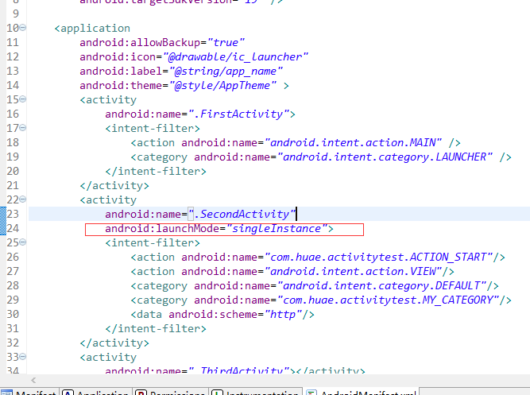

#### 5.1 standard

&emsp;&emsp;standard 是活动默认的启动模式，在不进行显式指定的情况下，所有活动都会自动使用这种启动模式。==每当启动一个新活动，都会重新创建新活动并放在返回栈的栈顶，不管返回栈栈中是否存在该活动==，资源消耗高。

#### 5.2 singleTop

&emsp;&emsp;和standard不同的是，==启动新活动是如果栈顶已经是该活动则不创建新活动==，而是直接使用该活动。 缺点：如果活动不再栈顶还是会创建新的活动。

#### 5.3 singleTask

&emsp;&emsp;解决了上述存在的两种问题==，启动新活动时首先在返回栈中查找是否有该活动的实例，如果有则将该活动以上的所有活动出栈并使用该活==动。缺点：导致活动其他活动提前finish()，影响体验。

#### 5.4 singleInstance

&emsp;&emsp;`launchMode`指定为singleInstance的活动会放在一个单独的栈中，可供多个应用程序共享。

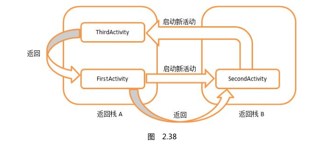

## 第三章 常用UI组件与布局

### 3.1 常用控件使用方法

#### 3.1.1 TextView

> 用于在界面显示一段文本 常用属性如下：


```xml
<TextView
    android:id="@+id/text_view"  指定id，用于定位控件、在代码中执行相关操作
    android:layout_width="match_parent" 可选:match_parent、fill_parent 和 wrap_content
    android:layout_height="wrap_content"  同上
    android:text="This is TextView"		设置显示的文本
    android:gravity="center" 		设置控件内文本的对齐方式
    android:textSize="24sp"			字体大小
    android:textColor="#00ff00" 	文字颜色/>
```

 #### 3.1.2 Button

> 显示按钮，Button继承自TextView。 可设置点击事件

```xml
<Button
    android:id="@+id/button"
    android:layout_width="match_parent"
    android:layout_height="wrap_content"
    android:text="Button" />
```

==添加点击事件的四种方式：==

* 匿名内部内(OnClickListener)

  ~~~Java
  public class MainActivity extends Activity{
      private Button button;

      @Overrid
      public void onCreate(Bundle savedInstanceState){
          super.onCreate(savedInstanceState);
          setContentView(R.layout.activity_main);
          button = (Button) findViewById(R.id.button);
          button.setOnClickListener(new OnClickListener() {
          	@Override
              public void onClick(View v) {
                  // 在此处添加逻辑
              }
          });
      }
  }
  ~~~

* activity实现OnClickListener接口,重写onClick方法

* 在xml中声明，在Java代码中实现

  ```xml
  <LinearLayout xmlns:android="http://schemas.android.com/apk/res/android"
      xmlns:tools="http://schemas.android.com/tools"
      android:layout_width="match_parent"
      android:layout_height="match_parent"
      tools:context="com.example.button.MainActivity" >

      <Button
          android:onClick="btn"
          android:layout_width="wrap_content"
          android:layout_height="wrap_content"
          android:text="按钮" />

  </LinearLayout>
```
```java
  //在相应activity建立对应的方法
  //定义与XML种OnClick属性名字对应的方法 注意在方法参数种加上 View v
  public void btn(View v) {
      Toast.makeText(MainActivity.this, "设置Onclick属性", 	                           Toast.LENGTH_SHORT).show();
  }
```

* 编写内部类实现OnClickListener接口

```java
  private class MyListener implements OnClickListener{
	@Override
  		public void onClick(View v) {
  			// TODO Auto-generated method stub
  			callPhone();
  		}
  	}
  // 然后通过setOnClickListener给相应的按钮事件，参数为自定义类的实例
```

#### 3.1.3 EditText

> EditText是程序用于和用户进行交互的另一个重要控件，它允许用户在控件里输入和编 辑内容，并可以在程序中对这些内容进行处理

~~~xml
<LinearLayout xmlns:android="http://schemas.android.com/apk/res/android"
    android:layout_width="match_parent"
    android:layout_height="match_parent"
    android:orientation="vertical" >
	……
    <EditText
        android:id="@+id/edit_text"
        android:hint="Type something here" 设置输入框的提示文本
        android:maxLines="2" 最大显示行数，超出文本自动滚动
        android:layout_width="match_parent"
        android:layout_height="wrap_content" />
</LinearLayout>

<!-- 更多属性请查看文档-->
~~~

* 示例

  Button与EditText结合使用，实现点击Button显示EditText中的文本

  ~~~xml
  <!--布局文件-->
  <LinearLayout xmlns:android="http://schemas.android.com/apk/res/android"
  	android:layout_width="match_parent"
  	android:layout_height="match_parent"
  	android:orientation="vertical" >
  	……
  	<EditText
  		android:id="@+id/edit_text"
  		android:layout_width="match_parent"
  		android:layout_height="wrap_content"
  		android:hint="Type something here"
  		android:maxLines="2" />
  </LinearLayout>
  ~~~

  ~~~java
  // java代码
  public class MainActivity extends Activity implements OnClickListener {
  	private Button button;
  	private EditText editText;

  	@Override
  	protected void onCreate(Bundle savedInstanceState) {
  		super.onCreate(savedInstanceState);
  		setContentView(R.layout.activity_main);
  		button = (Button) findViewById(R.id.button);
  		editText = (EditText) findViewById(R.id.edit_text);
  		button.setOnClickListener(this);
  	}

  	@Override
  	public void onClick(View v) {
  		switch (v.getId()) {
  		case R.id.button:
  			String inputText = editText.getText().toString();
  			Toast.makeText(MainActivity.this, inputText, Toast.LENGTH_SHORT).show();
  			break;
  		default:
  			break;
  		}
  	}
  }
  ~~~

==下面只演示用法，控件具体属性查看相关文档==

#### 3.1.4 ImageView

> ImageView是用于在界面上展示图片的一个控件，通过它可以让我们的程序界面变得更加 丰富多彩

* 示例：点击按钮，切换图片

~~~xml
<!--布局文件-->
<LinearLayout xmlns:android="http://schemas.android.com/apk/res/android"
	android:layout_width="match_parent"
	android:layout_height="match_parent"
	android:orientation="vertical" >
	……
	<ImageView
		android:id="@+id/image_view"
		android:layout_width="wrap_content"
		android:layout_height="wrap_content"
		android:src="@drawable/ic_launcher" />
    <Button
        android:onClick="Button"
        android:layout_width="wrap_content"
        android:layout_height="wrap_content"
        android:text="切换图片" />
</LinearLayout>
~~~

~~~java
// Java代码
public class MainActivity extends Activity implements OnClickListener {
	private Button button; 
	private ImageView imageView;

    @Override
    protected void onCreate(Bundle savedInstanceState) {
	    super.onCreate(savedInstanceState);
	    setContentView(R.layout.activity_main);
	    button = (Button) findViewById(R.id.button);
	    imageView = (ImageView) findViewById(R.id.image_view);
	    button.setOnClickListener(this);
	}

   @Override
   public void onClick(View v) {
   	switch (v.getId()) {
    case R.id.button:
	   	imageView.setImageResource(R.drawable.jelly_bean);
	    break;
    default:
    	break;
    }
  }
}
~~~


#### 3.1.5 ProgressBar

> ProgressBar用于在界面上显示一个进度条，表示我们的程序正在加载一些数据

~~~xml
<LinearLayout xmlns:android="http://schemas.android.com/apk/res/android"
	android:layout_width="match_parent"
	android:layout_height="match_parent"
	android:orientation="vertical" >
	……
	<ProgressBar
		android:id="@+id/progress_bar"
		android:layout_width="match_parent"
		android:layout_height="wrap_content" />
</LinearLayout>

<!--额外属性 (水平情况下)
    style="?android:attr/progressBarStyleHorizontal" 进度条水平
    android:max="100"  最大进度
    android:progress="50" 设置初始进度
-->
~~~

* 默认ProgressBar是圆形的，可通过`style="?android:attr/progressBarStyleHorizontal"`属性设置为水平进度条。

* 通过visible属性设置进度条的可见性，特定情况下提升用户体验；

* Java代码中通过控件的==setVisible==方法控制控件显示与隐藏，可以传入 View.VISIBLE、View.INVISIBLE和 View.GONE三种值。

  ~~~xml
  <ProgressBar
  		android:id="@+id/progress_bar"
          android:visible="visible" 可选值：visible、invisible(不可见，占据位置)和 gone（不可见，不占据位置）
  		android:layout_width="match_parent"
  		android:layout_height="wrap_content" />
  ~~~


#### 3.1.6 AlertDialog

> AlertDialog可以在当前的界面弹出一个对话框，这个对话框是置顶于所有界面元素之上 的，能够屏蔽掉其他控件的交互能力，因此一般 AlertDialog都是用于提示一些非常重要的 内容或者警告信息。

```java
// Java代码点击按钮弹出对话框
public class MainActivity extends Activity implements OnClickListener {
	……
	@Override
    public void onClick(View v) {
		switch (v.getId()) {
		case R.id.button:
			AlertDialog.Builder dialog = new AlertDialog.Builder (MainActivity.this);
			dialog.setTitle("This is Dialog");
			dialog.setMessage("Something important.");
			dialog.setCancelable(false);
			dialog.setPositiveButton("OK", new DialogInterface. OnClickListener() {

				@Override
				public void onClick(DialogInterface dialog, int which) {
				}
			});
			dialog.setNegativeButton("Cancel", new DialogInterface. OnClickListener() {

			@Override
			public void onClick(DialogInterface dialog, int which) {
				}
			});
			dialog.show();
			break;
		default:
			break;
			}
		}
}
```

&emsp;&emsp;首先通过 AlertDialog.Builder创建出一个 AlertDialog的实例，然后可以为这个对话框设 置标题、内容、可否取消等属性，接下来调用 setPositiveButton()方法为对话框设置确定按钮 的点击事件，调用 setNegativeButton()方法设置取消按钮的点击事件，最后调用 show()方法 将对话框显示出来。


#### 3.1.7 ProgressDialog

> ProgressDialog和 AlertDialog有点类似，都可以在界面上弹出一个对话框，都能够屏蔽 掉其他控件的交互能力。不同的是，ProgressDialog会在对话框中显示一个进度条，一般是 用于表示当前操作比较耗时，让用户耐心地等待。

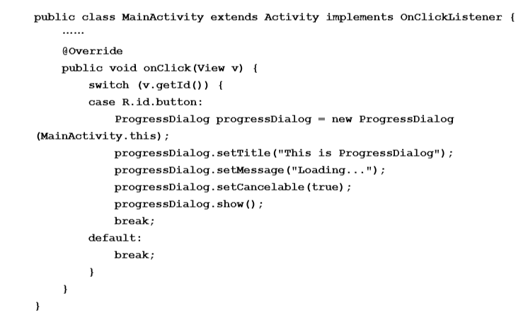

&emsp;&emsp;可以看到，这里也是先构建出一个 ProgressDialog对象，然后同样可以设置标题、内容、 可否取消等属性，最后也是通过调用 show()方法将 ProgressDialog显示出来。

==注意==：如果在 setCancelable()中传入了 false，表示 ProgressDialog是不能通过 Back键取消 掉的，这时你就一定要在代码中做好控制，当数据加载完成后必须要调用 ProgressDialog的 dismiss()方法来关闭对话框，否则 ProgressDialog将会一直存在。


### 3.2 四大基本布局

&emsp;&emsp;一个丰富的界面总是要由很多个控件组成的，那我们如何才能让各个控件都有条不紊地 摆放在界面上，而不是乱糟糟的呢？这就需要借助布局来实现了。布局是一种可用于放置很 多控件(控件和布局)的容器，它可以按照一定的规律调整内部控件的位置。

<center>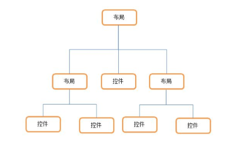

布局与控件的关系</center>

#### 3.3.1 LinearLayout

> LinearLayout又称作线性布局，是一种非常常用的布局。正如它名字所描述的一样，这 个布局会将它所包含的控件在==线性方向(垂直或水平)==上依次排列。

~~~xml
<LinearLayout xmlns:android="http://schemas.android.com/apk/res/android"
	android:layout_width="match_parent"
	android:layout_height="match_parent"
	android:orientation="vertical" >   可选值:horizontal(默认)、vertical,此处设置控件排列方向为垂直
</LinearLayout>

<!--
 android:layout_gravity="xxx" 控件相对父布局的对齐方式
 android:gravity="xxx" 控件内内容的对齐方式

 android:layout_weight="" 权重值
-->
~~~


#### 3.3.2 RelativeLayout

> RelativeLayout又称作相对布局，也是一种非常常用的布局。和 LinearLayout的排列规 则不同，RelativeLayout显得更加随意一些，它可以通过相对定位的方式让控件出现在布局 的任何位置。

~~~xml
<RelativeLayout xmlns:android="http://schemas.android.com/apk/res/android"
android:layout_width="match_parent"
android:layout_height="match_parent" >
	<Button
		android:id="@+id/button1"
		android:layout_width="wrap_content"
		android:layout_height="wrap_content"
		android:layout_alignParentLeft="true"
		android:layout_alignParentTop="true"
		android:text="Button 1" />
	<Button
		android:id="@+id/button2"
		android:layout_width="wrap_content"
		android:layout_height="wrap_content"
		android:layout_alignParentRight="true"
		android:layout_alignParentTop="true"
		android:text="Button 2" />
	<Button
		android:id="@+id/button3"
		android:layout_width="wrap_content"
		android:layout_height="wrap_content"
		android:layout_centerInParent="true"
		android:text="Button 3" />
	<Button
		android:id="@+id/button4"
		android:layout_width="wrap_content"
		android:layout_height="wrap_content"
		android:layout_alignParentBottom="true"
		android:layout_alignParentLeft="true"
		android:text="Button 4" />
	<Button
		android:id="@+id/button5"
		android:layout_width="wrap_content"
		android:layout_height="wrap_content"
		android:layout_alignParentBottom="true"
		android:layout_alignParentRight="true"
		android:text="Button 5" />
</RelativeLayout>
~~~

结果：

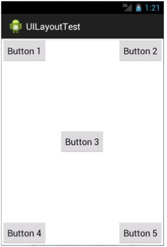

android:layout_alignParentxxx=“xxx”：相对父控件对齐

android:layout_xxx="@id/button3"
android:layout_toxxxOf="@id/button3" 联合使用:相对特定控件对齐

#### 3.3.3 FrameLayout

> FrameLayout相比于前面两种布局就简单太多了，因此它的应用场景也少了很多。这种 布局没有任何的定位方式，所有的控件都会摆放在布局的左上角。

~~~xml
<FrameLayout xmlns:android="http://schemas.android.com/apk/res/android"
android:layout_width="match_parent"
android:layout_height="match_parent" >
	<Button
		android:id="@+id/button"
		android:layout_width="wrap_content"
		android:layout_height="wrap_content"
		android:text="Button" />
	<ImageView
		android:id="@+id/image_view"
		android:layout_width="wrap_content"
		android:layout_height="wrap_content"
		android:src="@drawable/ic_launcher" />
</FrameLayout>
~~~

结果：

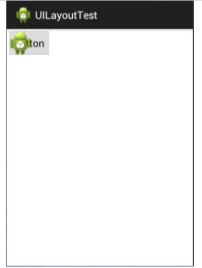

#### 3.3.4 TableLayout

> TableLayout允许我们使用表格的方式来排列控件

~~~xml
<TableLayout xmlns:android="http://schemas.android.com/apk/res/android"
	android:layout_width="match_parent"
	android:layout_height="match_parent"
    android:stretchColumns="1" >  第二列可以自动拉伸

	<TableRow>
		<TextView
		android:layout_height="wrap_content"
		android:text="Account:" />
		<EditText
		android:id="@+id/account"
		android:layout_height="wrap_content"
		android:hint="Input your account" />
	</TableRow>

	<TableRow>
		<TextView
		android:layout_height="wrap_content"
		android:text="Password:" />
		<EditText
		android:id="@+id/password"
		android:layout_height="wrap_content"
		android:inputType="textPassword" />
	</TableRow>

	<TableRow>
		<Button
		android:id="@+id/login"
		android:layout_height="wrap_content"
		android:layout_span="2"
		android:text="Login" />
	</TableRow>
</TableLayout>
<!--
android:layout_span="2" 让某一列占据两格的空间（合并单元格）
android:stretchColumns="x" 设置某一列可以拉伸，以达到自动适应屏幕宽度的作用
-->
~~~

结果 ：

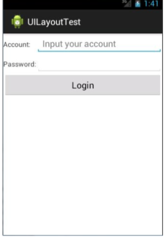

==注==: AbsoluteLayout绝对布局已不推荐使用.

### 3.3 简单创建自定义控件

> 通过控件组合创建自己需要的控件，并可复用该控件

&emsp;步骤：

1. 创建控件的xml布局文件

2. 在需要的地方使用include标签引入该布局文件(响应事件不方便)

3. 新建类==继承相应的布局或控件类或者之间继承View类==,在新类的构造函数中使用`LayoutInflater`动态加载布局

   ~~~java
   public class TitleLayout extends LinearLayout {
   	public TitleLayout(Context context, AttributeSet attrs) {
   		super(context, attrs);
   		LayoutInflater.from(context).inflate(R.layout.title, this);
   	}
   }
   ~~~

   此时在布局文件中需要使用完整类名引入该布局:

   ~~~xml
   <LinearLayout xmlns:android="http://schemas.android.com/apk/res/android"
   	android:layout_width="match_parent"
   	android:layout_height="match_parent" >

   	<com.example.uicustomviews.TitleLayout   引入布局
   		android:layout_width="match_parent"
   		android:layout_height="wrap_content" >
   	</com.example.uicustomviews.TitleLayout>
   </LinearLayout>
   ~~~

4. 在新类中根据需要为响应控件添加相应事件

   ~~~java
   public class TitleLayout extends LinearLayout {
   	public TitleLayout(Context context, AttributeSet attrs) {
   		super(context, attrs);
   			LayoutInflater.from(context).inflate(R.layout.title, this);
   			Button titleBack = (Button) findViewById(R.id.title_back);
   			Button titleEdit = (Button) findViewById(R.id.title_edit);
   			// 添加点击事件
   			titleBack.setOnClickListener(new OnClickListener() {

   			@Override
   			public void onClick(View v) {
   				((Activity) getContext()).finish();
   			}
   		});
           	// 添加点击事件
   			titleEdit.setOnClickListener(new OnClickListener() {

   			@Override
   			public void onClick(View v) {
   				Toast.makeText(getContext(), "You clicked Edit button", Toast.LENGTH_SHORT).show();
   			}
   		});
   	}
   }
   ~~~


### 3.4 ListView的使用与自定义ListView

#### 3.4.1 ListView的简单使用

~~~xml
<LinearLayout xmlns:android="http://schemas.android.com/apk/res/android"
	android:layout_width="match_parent"
	android:layout_height="match_parent" >
	<ListView
		android:id="@+id/list_view"
        android:entries="@array/ctype" 指定ListView的资源，本方式需要在values中创建资源文件
		android:layout_width="match_parent"
		android:layout_height="match_parent" >
	</ListView>
</LinearLayout>
~~~

资源文件arrays.xml

~~~xml
<resources>
	<string-array name="ctype">
    	<item>xxx</item>
        	...
        <item>xxx</item>
    </string-array>
</resources>
~~~

或者==在Java代码中通过适配器adapter为ListView设置资源==

~~~java
public class MainActivity extends Activity {
    private String[] data = { "Apple", "Banana", "Orange","Watermelon", "Pear", "Grape", "Pineapple", "Strawberry","Cherry", "Mango" };

    @Override
    protected void onCreate(Bundle savedInstanceState) {
        super.onCreate(savedInstanceState);
        setContentView(R.layout.activity_main);
        // 创建适配器 android.R.layout.simple_list_item_1 ListView每一项布局
        ArrayAdapter<String> adapter = new ArrayAdapter<String>(
            MainActivity.this, android.R.layout.simple_list_item_1,data);
        ListView listView = (ListView) findViewById(R.id.list_view);
        listView.setAdapter(adapter);
    }
}
~~~


#### 3.4.2 定制ListView

只能显示一段文本的 ListView实在是太单调了，我们现在就来对 ListView的界面进行定制，让它可以显示更加丰富的内容。

步骤：

1.  编写实体类，对应ListView每一项显示的数据，作为适配器的适配类型

   ~~~java
   package com.example.listviewtest.bean;

   public class Fruit {
   	private String fruitName;
   	private int imageId;

   	public Fruit(String fruitName, int imageId) {
   		this.fruitName = fruitName;
   		this.imageId = imageId;
   	}
   	public String getFruitName() {
   		return fruitName;
   	}
   	public void setFruitName(String fruitName) {
   		this.fruitName = fruitName;
   	}
   	public int getImageId() {
   		return imageId;
   	}
   	public void setImageId(int imageId) {
   		this.imageId = imageId;
   	}
   }
   ~~~

2. 创建ListView子项布局，即LsitView每一项的布局

   ~~~xml
   <?xml version="1.0" encoding="utf-8"?>
   <LinearLayout xmlns:android="http://schemas.android.com/apk/res/android"
       android:layout_width="match_parent"
       android:layout_height="wrap_content"
       android:orientation="horizontal" >

       <ImageView
           android:id="@+id/fruit_image"
           android:layout_width="wrap_content"
           android:layout_height="wrap_content"
           android:layout_gravity="center"
           android:src="@drawable/ic_launcher"/>
   	<TextView
   	    android:id="@+id/fruit_name"
   	    android:layout_width="wrap_content"
   	    android:layout_height="wrap_content"
   	    android:layout_marginLeft="10dp"
   	    android:layout_gravity="center_vertical"
   	    android:text="jjjjjjjjjjjjj"/>
   </LinearLayout>
   ~~~

3. 创建自定义适配器类

   ~~~java
   package com.example.listviewtest;

   import java.util.List;

   import android.content.Context;
   import android.view.LayoutInflater;
   import android.view.View;
   import android.view.ViewGroup;
   import android.widget.ArrayAdapter;
   import android.widget.ImageView;
   import android.widget.TextView;

   import com.example.listviewtest.bean.Fruit;

   public class FruitAdapter extends ArrayAdapter<Fruit> {

   	private int resourceId;

   	public FruitAdapter(Context context, int textViewResourceId,
   			List<Fruit> objects) {
   		super(context, textViewResourceId, objects);
   		// 获取布局
   		resourceId = textViewResourceId;
   	}

   	@Override
   	public View getView(int position, View convertView, ViewGroup parent) {
   		// 获取对应数据项
   		Fruit item = getItem(position);
   		// 加载布局
   		View view;
   		ViewHolder viewHolder;
   		// 1. 解决每次getView是都重新加载view 提升效率
   		if (convertView == null) {
   			view = LayoutInflater.from(getContext()).inflate(resourceId, null);

   			// 缓存实例 提升效率
   			viewHolder = new ViewHolder();
   			viewHolder.fruitImage = (ImageView) view
   					.findViewById(R.id.fruit_image);
   			viewHolder.fruitName = (TextView) view
   					.findViewById(R.id.fruit_name);

   			view.setTag(viewHolder);
   		} else {
   			view = convertView;
   			viewHolder = (ViewHolder) view.getTag();
   		}

   		// View view = LayoutInflater.from(getContext()).inflate(resourceId,
   		// parent);
   		// java.lang.UnsupportedOperationException: addView(View, LayoutParams)
   		// is not supported in AdapterView

   		// 设置数据
   		/*
   		 * ImageView fruitImage = (ImageView)
   		 * view.findViewById(R.id.fruit_image);
   		 * fruitImage.setImageResource(item.getImageId());
   		 *
   		 * TextView fruitName = (TextView) view.findViewById(R.id.fruit_name);
   		 * fruitName.setText(item.getFruitName());
   		 */

   		viewHolder.fruitImage.setImageResource(item.getImageId());
   		viewHolder.fruitName.setText(item.getFruitName());
   		return view;
   	}

   	// 2. 保存findViewById的实例 提升效率
   	class ViewHolder {
   		ImageView fruitImage;
   		TextView fruitName;
   	}
   }

   ~~~

4. 创建资源文件，用资源文件创建适配器，为ListView设置适配器

```java
   	package com.example.listviewtest;

   import java.util.ArrayList;

   import com.example.listviewtest.bean.Fruit;

   import android.app.Activity;
   import android.app.AlertDialog;
   import android.content.DialogInterface;
   import android.os.Bundle;
   import android.view.Menu;
   import android.view.View;
   import android.widget.AdapterView;
   import android.widget.ArrayAdapter;
   import android.widget.ListView;

   public class MainActivity extends Activity {
   	private ListView listView;
   	private ArrayList<Fruit> fruitist = new ArrayList<Fruit>();

   	@Override
   	protected void onCreate(Bundle savedInstanceState) {
   		super.onCreate(savedInstanceState);
   		setContentView(R.layout.activity_main);

   		listView = (ListView) findViewById(R.id.list_view);
   		initFruits();

   		// 简单ListView 每行只有一个文本
   		// simpleListView();

   		// 复杂的ListView 显示图片和文本
   		complexListView(listView);
   		// 设置点击事件
   		listView.setOnItemClickListener(new AdapterView.OnItemClickListener() {

   			@Override
   			public void onItemClick(AdapterView<?> parent, View view,
   					int position, long id) {
   				Fruit fruit = fruitist.get(position);
   				new AlertDialog.Builder(MainActivity.this)
   						.setTitle("详情")
   						.setMessage(
   								"你点击了'" + fruit.getFruitName() + "'  id"
   										+ fruit.getImageId())
   						.setPositiveButton("确定",
   								new DialogInterface.OnClickListener() {

   									@Override
   									public void onClick(DialogInterface dialog,
   											int which) {

   									}
   								}).show();
   			}
   		});
   	}

   	private void complexListView(ListView listView) {
   		FruitAdapter adapter = new FruitAdapter(MainActivity.this,
   				R.layout.fruit_layout, fruitist);
   		listView.setAdapter(adapter);
   	}

   	private void initFruits() {
   		fruitist.add(new Fruit("apple", R.drawable.apple_pic));
   		fruitist.add(new Fruit("banana", R.drawable.banana_pic));
   		fruitist.add(new Fruit("cherry", R.drawable.cherry_pic));
   		fruitist.add(new Fruit("grape", R.drawable.grape_pic));
   		fruitist.add(new Fruit("mango", R.drawable.mango_pic));
   		fruitist.add(new Fruit("orange", R.drawable.orange_pic));
   		fruitist.add(new Fruit("pear", R.drawable.pear_pic));
   		fruitist.add(new Fruit("pineapple", R.drawable.pineapple_pic));
   		fruitist.add(new Fruit("strawberry", R.drawable.strawberry_pic));
   		fruitist.add(new Fruit("watermelon", R.drawable.watermelon_pic));
   		...
   	}
```
```java

   	private void simpleListView() {
   		// 准备数据
   		String[] data = { "Apple", "Banana", "Orange", "Watermelon", "Pear",
"Grape", "Pineapple", "Strawberry", "Cherry", "Mango", "Apple","Banana", "Orange", "Watermelon", "Pear", "Grape", "Pineapple",
 "Strawberry", "Cherry", "Mango" };
   		// 创建适配器 指定listView的上下文、每一项(行)的布局和内容
   		ArrayAdapter<String> adapter = new ArrayAdapter<String>(
   				MainActivity.this, android.R.layout.simple_list_item_1, data);
   		listView.setAdapter(adapter);
   	}
   }
```

5. 为ListView设置相应事件

#### 3.4.3  单位和尺寸

&emsp;&emsp;在编写 Android程序的时候，尽量将控件或布局的大小指定成 match_parent 或 wrap_content，如果必须要指定一个固定值，则使用 dp来作为单位，指定文字大小的时候 使用 sp作为单位。

### 3.5 制作 Nine-Patch图片

&emsp;&emsp;当图片大小不能满足控件大小时，图片被均匀拉伸，不美观，可以使用 Nine-Patch做特殊处理。

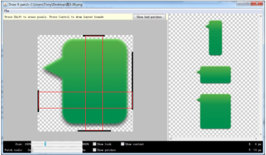

&emsp;&emsp;如图所示，当图片需要拉伸时，只会拉伸红色矩形范围的图片，不会造成图片不美观的结果。

## 第四章 碎片Fragment的使用

### 4.1 碎片是什么
> 碎片（Fragment）是一种可以嵌入在活动当中的 UI 片段，它能让程序更加合理和充分地利用大屏幕的空间，因而在平板上应用的非常广泛。

### 4.2 碎片的使用方式
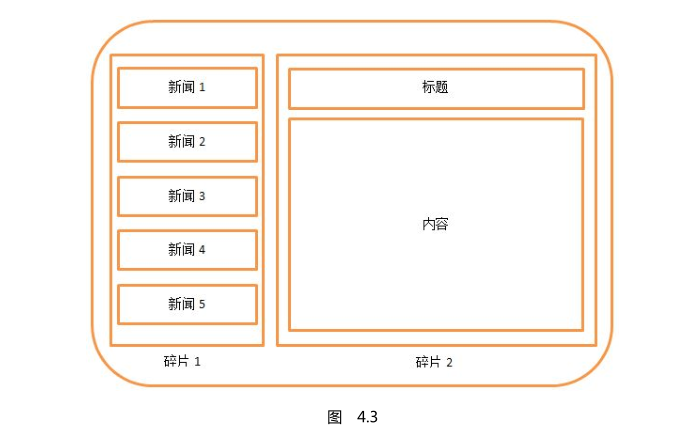
<center>碎片通常都是在平板开发中才会使用的.</center>

#### 4.2.1 碎片的简单使用方法
##### 1. 准备碎片布局文件

```xml
	<!-- 在一个活动中添加两个碎片,并让这两个碎片平分活动控件 -->

	<!-- 左侧碎片布局 left_fragment.xml-->
	<?xml version="1.0" encoding="utf-8"?>
	<LinearLayout xmlns:android="http://schemas.android.com/apk/res/android"
		android:layout_width="match_parent"
		android:layout_height="match_parent"
		android:orientation="vertical" >

		<Button
			android:id="@+id/button"
			android:layout_width="wrap_content"
			android:layout_height="wrap_content"
			android:layout_gravity="center_horizontal"
			android:text="button"/>

	</LinearLayout>

	<!-- 右侧碎片布局right_fragment.xml -->
	<?xml version="1.0" encoding="utf-8"?>
	<LinearLayout xmlns:android="http://schemas.android.com/apk/res/android"
		android:layout_width="match_parent"
		android:layout_height="match_parent"
		android:background="#0f0"
		android:orientation="vertical" >

		<TextView
			android:id="@+id/textView"
			android:layout_width="wrap_content"
			android:layout_height="wrap_content"
			android:layout_gravity="center_horizontal"
			android:textSize="20sp"
			android:text="right fragment"/>

</LinearLayout>
```
##### 2. 创建fragment:新建类继承fragment,加载布局文件

```JAVA
// LeftFragment
public class LeftFragment extends Fragment {
	@Override
	public View onCreateView(LayoutInflater inflater, ViewGroup container,
	Bundle savedInstanceState) {
		View view = inflater.inflate(R.layout.left_fragment, container, false);
		return view;
	}
}

// RightFragment
public class RightFragment extends Fragment {
	@Override
	public View onCreateView(LayoutInflater inflater, ViewGroup container,
	Bundle savedInstanceState) {
	View view = inflater.inflate(R.layout.right_fragment, container, false);
	return view;
}
}
```
##### 3. 在activity引入碎片
```xml
	<!-- 布局文件activity_main.xml -->
	<LinearLayout xmlns:android="http://schemas.android.com/apk/res/android"
		android:layout_width="match_parent"
		android:layout_height="match_parent" >
		<fragment
			android:id="@+id/left_fragment"
			android:name="com.example.fragmenttest.LeftFragment"
			android:layout_width="0dp"
			android:layout_height="match_parent"
			android:layout_weight="1" />
		<fragment
			android:id="@+id/right_fragment"
			android:name="com.example.fragmenttest.RightFragment"
			android:layout_width="0dp"
			android:layout_height="match_parent"
			android:layout_weight="1" />
	</LinearLayout>
```
```java
	// activity代码
	public class MainActivity extends Activity {

	@Override
	protected void onCreate(Bundle savedInstanceState) {
		super.onCreate(savedInstanceState);
		setContentView(R.layout.activity_main);
	}
}
```

效果如下:
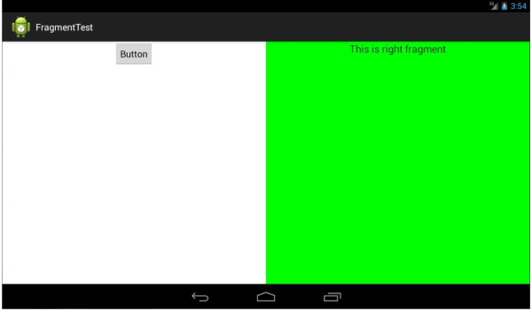

#### 4.2.2 动态添加碎片
&emsp;&emsp;静态的fragment使用不灵活,下面演示fragment的动态加载.
##### 1. 使用同样的方法准备AntoherFragment
```xml
	<!-- another_fragment.xml -->
	<LinearLayout xmlns:android="http://schemas.android.com/apk/res/android"
		android:layout_width="match_parent"
		android:layout_height="match_parent"
		android:background="#ffff00"
		android:orientation="vertical" >
		<TextView
			android:layout_width="wrap_content"
			android:layout_height="wrap_content"
			android:layout_gravity="center_horizontal"
			android:textSize="20sp"
			android:text="This is another right fragment"
		/>
	</LinearLayout>
```
```java
public class AnotherRightFragment extends Fragment {
	@Override
	public View onCreateView(LayoutInflater inflater, ViewGroup container,
		Bundle savedInstanceState) {
		View view = inflater.inflate(R.layout.another_right_fragment,
		container, false);
		return view;
	}
}
```
##### 2. 修改activity_main.xml
```xml
<LinearLayout xmlns:android="http://schemas.android.com/apk/res/android"
	android:layout_width="match_parent"
	android:layout_height="match_parent">
	<fragment
		android:id="@+id/left_fragment"
		android:name="com.example.fragmenttest.LeftFragment"
		android:layout_width="0dp"
		android:layout_height="match_parent"
		android:layout_weight="1" />
	<FrameLayout
		android:id="@+id/right_layout"
		android:layout_width="0dp"
		android:layout_height="match_parent"
		android:layout_weight="1" >
		<fragment
			android:id="@+id/right_fragment"
			android:name="com.example.fragmenttest.RightFragment"
			android:layout_width="match_parent"
			android:layout_height="match_parent" />
	</FrameLayout>
</LinearLayout>
```
<center>左边不变,右边使用Frament包裹fragment</center>

##### 3. 为按钮绑定事件,实现点击按钮切换fragment
```java
public class MainActivity extends Activity implements OnClickListener {
	@Override
	protected void onCreate(Bundle savedInstanceState) {
		super.onCreate(savedInstanceState);
		setContentView(R.layout.activity_main);
		Button button = (Button) findViewById(R.id.button);
		button.setOnClickListener(this);
	}
	@Override
	public void onClick(View v) {
		switch (v.getId()) {
		case R.id.button:
			AnotherRightFragment fragment = new AnotherRightFragment();
			FragmentManager fragmentManager = getFragmentManager();
			FragmentTransaction transaction = fragmentManager.
			beginTransaction();
			transaction.replace(R.id.right_layout, fragment);
			transaction.commit();
			break;
		default:
			break;
		}
	}
}
```

可以看到，首先我们给左侧碎片中的按钮注册了一个点击事件，然后将动态添加碎片的逻辑都放在了点击事件里进行。结合代码可以看出，动态添加碎片主要分为 5 步。
1. 创建待添加的碎片实例。
2. 获取到 FragmentManager，在活动中可以直接调用 getFragmentManager()方法得到。
3. 开启一个事务，通过调用 beginTransaction()方法开启。
4. 向容器内加入碎片，一般使用 replace()方法实现，需要传入容器的 id 和待添加的碎
片实例。
5. 提交事务，调用 commit()方法来完成。

<center>点击后结果</center>
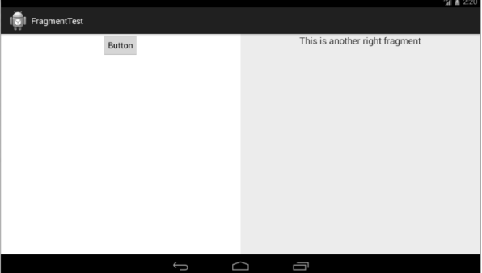

##### 4.2.3 在碎片中模拟返回栈
&emsp;&emsp;在上一小节中，我们成功实现了向活动中动态添加碎片的功能，不过你尝试一下就会发
现，通过点击按钮添加了一个碎片之后，这时按下 Back 键程序就会直接退出。如果这里我们想模仿类似于返回栈的效果，按下 Back 键可以回到上一个碎片，该如何实现呢？

&emsp;&emsp;其实很简单，FragmentTransaction 中提供了一个 addToBackStack()方法，可以用于将一个事务添加到返回栈中，修改 MainActivity 中的代码，如下所示：
```java

public class MainActivity extends Activity implements OnClickListener {
	……
	@Override
	public void onClick(View v) {
		switch (v.getId()) {
		case R.id.button:
			AnotherRightFragment fragment = new AnotherRightFragment();
			FragmentManager fragmentManager = getFragmentManager();
			FragmentTransaction transaction = fragmentManager.
			beginTransaction();
			transaction.replace(R.id.right_layout, fragment);
			transaction.addToBackStack(null);	//模拟返回栈步骤
			transaction.commit();

			break;
		default:
			break;
		}
	}
}
```
&emsp;&emsp;这里我们在事务提交之前调用了 FragmentTransaction 的 addToBackStack()方法，它可以接收一个名字用于描述返回栈的状态，一般传入 null 即可。现在重新运行程序，并点击按钮将 AnotherRightFragment 添加到活动中，然后按下 Back 键，你会发现程序并没有退出，而是回到了 RightFragment 界面，再次按下 Back 键程序才会退出。

##### 4.2.4 碎片与活动进行通信

&emsp;&emsp;为了方便碎片和活动之间进行通信，FragmentManager提供了一个类似于findViewById()的方法，专门用于从布局文件中获取碎片的实例，代码如下所示：
`RightFragment rightFragment = (RightFragment) getFragmentManager()
.findFragmentById(R.id.right_fragment);`

&emsp;&emsp;调用 FragmentManager 的 findFragmentById()方法，可以在活动中得到相应碎片的实例，然后就能轻松地调用碎片里的方法了。

&emsp;&emsp;同样,在每个碎片中可以通过调用 getActivity()方法来得到和当前碎片相关联
的活动实例，代码如下所示：
`MainActivity activity = (MainActivity) getActivity();`

&emsp;&emsp;另外当碎片中需要使用 Context 对象时，也可以使用 getActivity()方法.

### 4.3 碎片的生命周期
> 和活动一样，碎片也有自己的生命周期

#### 4.3.1 碎片的状态和回调
1. 运行状态
&emsp;&emsp;当一个碎片是可见的，并且它所关联的活动正处于运行状态时，该碎片也处于运行状态。
2. 暂停状态
&emsp;&emsp;当一个活动进入暂停状态时（由于另一个未占满屏幕的活动被添加到了栈顶），与它相关联的可见碎片就会进入到暂停状态。
3. 停止状态
&emsp;&emsp;当一个活动进入停止状态时，与它相关联的碎片就会进入到停止状态。或者通过调
用 FragmentTransaction 的 remove()、replace()方法将碎片从活动中移除，但有在事务提
交之前调用 addToBackStack()方法，这时的碎片也会进入到停止状态。总的来说，进入
停止状态的碎片对用户来说是完全不可见的，有可能会被系统回收。
4. 销毁状态
&emsp;&emsp;碎片总是依附于活动而存在的，因此当活动被销毁时，与它相关联的碎片就会进入
到销毁状态。或者通过调用 FragmentTransaction 的 remove()、replace()方法将碎片从活
动中移除，但在事务提交之前并没有调用 addToBackStack()方法，这时的碎片也会进入
到销毁状态。

&emsp;&emsp;Fragment 类中也提供了一系列的回调方法，以覆盖碎片生命周期的每个环节。其中，活动中有的回调方法，碎片中几乎都有，不过碎片还提供了一些附加的回调方法，那我们就重点来看下这几个回调。
1. onAttach()
&emsp;&emsp;当碎片和活动建立关联的时候调用。
2. onCreateView()
为碎片创建视图（加载布局）时调用。
3. onActivityCreated()
&emsp;&emsp;确保与碎片相关联的活动一定已经创建完毕的时候调用。
4. onDestroyView()
&emsp;&emsp;当与碎片关联的视图被移除的时候调用。
5. onDetach()
&emsp;&emsp;当碎片和活动解除关联的时候调用。

&emsp;&emsp;&emsp;&emsp;&emsp;&emsp;&emsp;&emsp;碎片生命周期
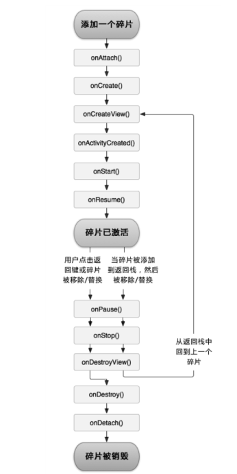

#### 4.3.2 体验碎片的生命周期
> 为了让你能够更加直观地体验碎片的生命周期，我们还是通过一个例子来实践一下

修改 RightFragment 中的代码，如下所示：
```java
public class RightFragment extends Fragment {
	public static final String TAG = "RightFragment";
	@Override
	public void onAttach(Activity activity) {
		super.onAttach(activity);
		Log.d(TAG, "onAttach");
	}
	@Override
	public void onCreate(Bundle savedInstanceState) {
		super.onCreate(savedInstanceState);
		Log.d(TAG, "onCreate");
	}
	@Override
	public View onCreateView(LayoutInflater inflater, ViewGroup container,
	Bundle savedInstanceState) {
		Log.d(TAG, "onCreateView");
		View view = inflater.inflate(R.layout.right_fragment, container, false);
		return view;
	}
	@Override
	public void onActivityCreated(Bundle savedInstanceState) {
		super.onActivityCreated(savedInstanceState);
		Log.d(TAG, "onActivityCreated");
	}
	@Override
	public void onStart() {
		super.onStart();
		Log.d(TAG, "onStart");
	}

	@Override
	public void onResume() {
		super.onResume();
		Log.d(TAG, "onResume");
	}
	@Override
	public void onPause() {
		super.onPause();
		Log.d(TAG, "onPause");
	}
	@Override
	public void onStop() {
		super.onStop();
		Log.d(TAG, "onStop");
	}
	@Override
	public void onDestroyView() {
		super.onDestroyView();
		Log.d(TAG, "onDestroyView");
	}
	@Override
	public void onDestroy() {
		super.onDestroy();
		Log.d(TAG, "onDestroy");
	}
	@Override
	public void onDetach() {
		super.onDetach();
		Log.d(TAG, "onDetach");
	}
}
```
当 RightFragment 第一次被加载到屏幕上
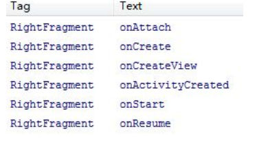

点击按钮切换fragment
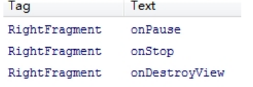

按back键返回
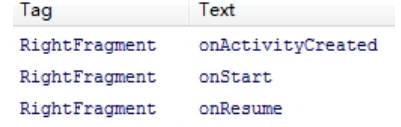

按back退出
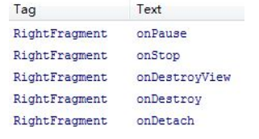

&emsp;&emsp;另外值得一提的是，在碎片中也可以通过 onSaveInstanceState()方法来保存数据的，因为进入停止状态的碎片可能在系统内存不足的时候被回收。保存下来的数据在onCreate()、onCreateView()和 onActivityCreated()这三个方法中你都可以重新得到，它们都含有一个 Bundle 类型的 savedInstanceState 参数。

### 4.4 动态加载布局的技巧
> 使程序能够根据设备的分辨率或屏幕大小在运行时来决定加载哪个布局

#### 4.4.1 使用限定符
> 使用方法:布局文件使用 res目录下新建layout-xxx目录放置对应的布局文件即可,'xxx'为相应的限定符
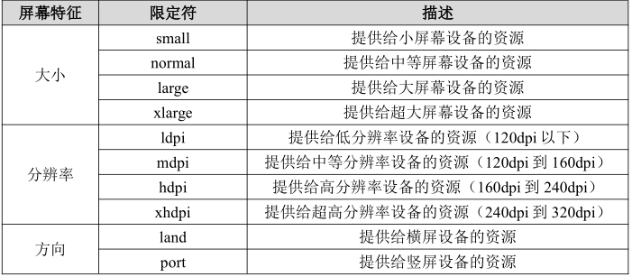

#### 4.4.2 使用最小宽度限定符
> 使用精确的大小限定加载哪个布局文件
使用方法:布局文件使用 res目录下新建layout-swxxxdp目录放置对应的布局文件即可,'xxx'为相应的屏幕宽度大小 

&emsp;&emsp;如:layout-ws600dp(res下新建目录)代表当设备屏幕宽度大于600时会加载本目录下的布局文件,否则加载默认目录下的文件...

### 4.5 碎片实践--简易版的新闻应用
&emsp;&emsp;本应用使用fragment采用动态加载布局的方式,加载相应的资源文件,且实现了fragment的动态切换.[查看代码](https://github.com/Huae/FirstLineCodeNote/tree/master/project/FragmentBestPractice)


## 第五章 全局大喇叭,详解广播机制

### 5.1 广播机制简介

&emsp;&emsp;正如其名,广播就是Android系统或系统中某个app向外发出的可供其他程序处理的一种消息的方式.利用这中机制可灵活实现Android进程间的通信.

>  Android 中的每个应用程序都可以对自己感兴趣的广播进行注册，这样该程序就只会接收到自己所关心的广播内容，这些广播可能是来自于系统的，也可能是来自于其他应用程序的。Android 提供了一套完整的 API，允许应用程序自由地发送和接收广播。接受广播需要广播接收器 ==BroadcaseReceiver==

##### Android系统广播的类别如下:

###### 1. 标准广播
	标准广播（Normal broadcasts）是一种完全异步执行的广播，在广播发出之后，所有的广播接收器几乎都会在同一时刻接收到这条广播消息，因此它们之间没有任何先后顺序可言。这种广播的效率会比较高，但同时也意味着它是无法被截断的。

###### 2. 有序广播
	有序广播（Ordered broadcasts）则是一种同步执行的广播，在广播发出之后，同一时刻只会有一个广播接收器能够收到这条广播消息，当这个广播接收器中的逻辑执行完毕后，广播才会继续传递。所以此时的广播接收器是有先后顺序的，优先级高的广播接收器就可以先收到广播消息，并且前面的广播接收器还可以截断正在传递的广播，这样后面的广播接收器就无法收到广播消息了。

### 5.2 接收系统广播

> Android 内置了很多系统级别的广播，我们可以在应用程序中通过监听这些广播来得到各种系统的状态信息。

#### 5.2.1 动态注册监听网络变化
##### 步骤:
###### 1. 创建对应的广播接收器
```java
class NetworkChangeReceiver extends BroadcastReceiver {
	@Override
	public void onReceive(Context context, Intent intent) {
		Toast.makeText(context, "network changes",
		Toast.LENGTH_SHORT).show();
	}
}
```
###### 2. 注册广播
```java
public class MainActivity extends Activity {
	private IntentFilter intentFilter;
	private NetworkChangeReceiver networkChangeReceiver;
	@Override
	protected void onCreate(Bundle savedInstanceState) {
		super.onCreate(savedInstanceState);
		setContentView(R.layout.activity_main);
		// 添加感兴趣的广播类型
		intentFilter = new IntentFilter();
	       intentFilter.addAction("android.net.conn.CONNECTIVITY_CHANGE");
		networkChangeReceiver = new NetworkChangeReceiver();
		// 注册广播
		registerReceiver(networkChangeReceiver, intentFilter);
	}

	@Override
	protected void onDestroy() {
		super.onDestroy();
		// 活动销毁 取消广播注册
		unregisterReceiver(networkChangeReceiver);
	}

	/** 广播接收器内部类*/
	class NetworkChangeReceiver extends BroadcastReceiver {
		// 收到广播时执行本方法
		@Override
		public void onReceive(Context context, Intent intent) {
			// 在这里实现相应逻辑
			Toast.makeText(context, "network changes",
			Toast.LENGTH_SHORT).show();
		}
	}
}
```

##### == 注: ==  活动销毁时一定要取消动态注册的广播!!!

#### 5.2.2 静态注册实现开机启动
> 动态注册的广播接收器可以自由地控制注册与注销，在灵活性方面有很大的优势，但是它也存在着一个缺点，即必须要在程序启动之后才能接收到广播，因为注册的逻辑是写在onCreate()方法中的。

&emsp;&emsp;下面演示广播的静态注册:
###### 1. 同样是先创建广播接收器类 ==必须是单独的类,不能是内部类.==
```java
public class BootCompleteReceiver extends BroadcastReceiver {
	@Override
	public void onReceive(Context context, Intent intent) {
		Toast.makeText(context, "Boot Complete", Toast.LENGTH_LONG).show();
	}
}
```
###### 2. 在manifest文件中注册广播
```xml
<manifest xmlns:android="http://schemas.android.com/apk/res/android"
	package="com.example.broadcasttest"
	android:versionCode="1"
	android:versionName="1.0" >
	……
	<!-- 声明需要使用的权限 -->
	<uses-permission android:name="android.permission.ACCESS_NETWORK_STATE" />
	<uses-permission android:name="android.permission.RECEIVE_BOOT_COMPLETED" />
	<application
		android:allowBackup="true"
		android:icon="@drawable/ic_launcher"
		android:label="@string/app_name"
		android:theme="@style/AppTheme" >
	……
	<!-- 静态注册广播接收器 -->
		<receiver android:name=".BootCompleteReceiver" >
			<intent-filter>
			<!-- 声明感兴趣的广播 这里为系统开机启动广播-->
				<action android:name="android.intent.action.BOOT_COMPLETED" />
			</intent-filter>
		</receiver>
	</application>
</manifest>
```
###### ==注:== 不要再广播接收器里(`onReceive()`)方法中执行耗时操作!!!

### 5.3 发送自定义广播
> 发送自定义广播即使用intent发送广播时指定一个自定义的action值

#### 5.3.1 发送标准广播
###### 1. 创建广播接收器
```java
public class MyBroadcastReceiver extends BroadcastReceiver {
	@Override
	public void onReceive(Context context, Intent intent) {
		Toast.makeText(context, "received in MyBroadcastReceiver",
		Toast.LENGTH_SHORT).show();
	}
}
```
###### 2. 注册广播
```xml
<manifest xmlns:android="http://schemas.android.com/apk/res/android"
	package="com.example.broadcasttest"
	android:versionCode="1"
	android:versionName="1.0" >
	……
	<application
		android:allowBackup="true"
		android:icon="@drawable/ic_launcher"
		android:label="@string/app_name"
		android:theme="@style/AppTheme" >
	……
		<receiver android:name=".MyBroadcastReceiver">
			<intent-filter>
			<!-- action为自定义广播类型 -->
				<action android:name="com.example.broadcasttest. MY_BROADCAST"/>
			</intent-filter>
		</receiver>
	</application>
</manifest>
```
###### 3. 根据需要在合适的时机发送广播
```java
// 点击按钮发送广播
public class MainActivity extends Activity {
	@Override
	protected void onCreate(Bundle savedInstanceState) {
		super.onCreate(savedInstanceState);
		setContentView(R.layout.activity_main);
		Button button = (Button) findViewById(R.id.button);
		button.setOnClickListener(new OnClickListener() {
		@Override
		public void onClick(View v) {
			Intent intent = new Intent("com.example.broadcasttest.
			MY_BROADCAST");
			sendBroadcast(intent);	// 发送自定义广播
		}
	});
	}
}
```
&emsp;&emsp;这样点击按钮就会发送一条自定义的广播,广播接收器受收到广播后就会执行相应的逻辑.

#### 5.3.2 发送有序广播
&emsp;&emsp;步骤与发送标准广播一样,只是发送广播时使用的是`sendOrderedBroadcast(intent, null)`
```java
public class MainActivity extends Activity {
	……
	@Override
	protected void onCreate(Bundle savedInstanceState) {
	...
	Button button = (Button) findViewById(R.id.button);
	button.setOnClickListener(new OnClickListener() {
	@Override
	public void onClick(View v) {
		Intent intent = new Intent("com.example.broadcasttest.
		MY_BROADCAST");
		// 发送有序广播,第二个参数是与权限相关的字符串
		sendOrderedBroadcast(intent, null);
	}
	});
	}
}
```

&emsp;&emsp;与标准广播不同的是,有序广播的接受传递按照广播接收器的优先级进行传播,并且先接收到广播的接收器可以阻断广播的传递.

==设置广播接收器的优先级:==
```xml
<manifest xmlns:android="http://schemas.android.com/apk/res/android"
	...>
	...
	<receiver android:name=".MyBroadcastReceiver">
		<!-- priority指定优先级 值越大优先级越高-->
		<intent-filter android:priority="100" >
			<action android:name="com.example.broadcasttest.MY_BROADCAST"/>
		</intent-filter>
	</receiver>

</manifest>
```
==阻断广播向下传递:==
```java
public class MyBroadcastReceiver extends BroadcastReceiver {
	@Override
	public void onReceive(Context context, Intent intent) {
		Toast.makeText(context, "received in MyBroadcastReceive",
		Toast.LENGTH_SHORT).show();
		abortBroadcast();	// 阻断广播传递
	}
}
```
### 5.4 使用本地广播

> 本地广播:只在本应用程序中传递的广播, 广播接收器也只接收本程序的广播, (防止数据泄露,接收器被干扰等)

&emsp;&emsp;发送本地广播示例:
```java
public class MainActivity extends Activity {
	private IntentFilter intentFilter;
	private LocalReceiver localReceiver;
	private LocalBroadcastManager localBroadcastManager;
	@Override
	protected void onCreate(Bundle savedInstanceState) {
	...
	localBroadcastManager = LocalBroadcastManager.getInstance(this);
	//  获取实例
	Button button = (Button) findViewById(R.id.button);
	button.setOnClickListener(new OnClickListener() {
	@Override
	public void onClick(View v) {
		Intent intent = new Intent("com.example.broadcasttest.
		LOCAL_BROADCAST");
		localBroadcastManager.sendBroadcast(intent); //  发送本地广播
	}
	});
	intentFilter = new IntentFilter();
	intentFilter.addAction("com.example.broadcasttest.LOCAL_BROADCAST");
	localReceiver = new LocalReceiver();
	localBroadcastManager.registerReceiver(localReceiver, intentFilter);
	//  注册本地广播监听器
	}
	@Override
	protected void onDestroy() {
		super.onDestroy();
		// 取消广播注册
		localBroadcastManager.unregisterReceiver(localReceiver);
	}
	class LocalReceiver extends BroadcastReceiver {
	@Override
	public void onReceive(Context context, Intent intent) {
		Toast.makeText(context, "received local broadcast",
		Toast.LENGTH_SHORT).show();
	}
	}
}
```
&emsp;&emsp;与全局广播不同的是:这里是通过 `LocalBroadcastManager. getInstance()`得到了它的一个实例，然后在注册广播接收器的时候用的是`LocalBroadcastManager.registerReceiver()`，在发送广播的时候调用的是 `LocalBroadcastManager.sendBroadcast()`，取消是使用`localBroadcastManager.unregisterReceiver(localReceiver)`。

### 5.5 广播最佳实践--仿QQ强制下线
设置对话框类型为系统级对话框
`alertDialog.getWindow().setType(WindowManager.LayoutParams.TYPE_SYSTEM_ALERT);`

` 注:`
* 使用集合保存所有打开的activity强制下线时可快速关闭所有activity;
* 强制下先逻辑写在接收器里,做到下线逻辑不依附于任何界面.

代码地址:[传送门](https://github.com/Huae/FirstLineCodeNote/tree/master/project/BestBroadcastPratice)

## 第六章 数据存储,持久化全方案
### 6.1 持久化技术简介
> 数据持久化就是指将那些内存中的瞬时数据保存到存储设备中，保证即使在手机或电脑关机的情况下，这些数据仍然不会丢失。

&emsp;&emsp;`Android 系统中主要提供了三种方式用于简单地实现数据持久化功能，即文件存储、SharedPreference存储以及数据库存储`

### 6.2 文件存储
#### 6.2.1 保存数据
> 文件存储是 Android 中最基本的一种数据存储方式，它不对存储的内容进行任何的格式化处理，所有数据都是原封不动地保存到文件当中的，因而它比较适合用于存储一些简单的文本数据或二进制数据。

&emsp;&emsp;使用`Context`类的`openFileOutput()`方法获文件输出流对象,然后采用java流的方式将数据写入到文件中.该方法接受两个参数,第一个参数为所保存文件名(包含文件后缀),第二各参数为文件的操作模式(覆盖原文件或追加内容).

```java
private void save(String text) {
	FileOutputStream out = null;
	BufferedWriter writer = null;
	try {
		// 获取输出流 指定文件名和文件操作模式(当前模式为覆盖原内容)
		out = openFileOutput("data", Context.MODE_PRIVATE);
		writer = new BufferedWriter(new OutputStreamWriter(out));
		writer.write(text);
	} catch (Exception e) {
		e.printStackTrace();
	} finally {
		if (writer != null) {
			try {
				writer.close();
			} catch (IOException e) {
				e.printStackTrace();
			}
		}
	}
}
```
`文件保存的路径为:/data/data/<packagename>/files/目录下`

### 6.2.2 读取数据
&emsp;&emsp;同样,我们可以通过`Context`的`openFileInput()`方法获取到文件输入流,然后读取保存到文件中的数据.该方法的唯一参数为保存的`文件名`
```java
private String load() {
	FileInputStream in = null;
	BufferedReader reader = null;
	StringBuilder content = new StringBuilder();
	try {
		// 获取文件输入流
		in = openFileInput("data");
		reader = new BufferedReader(new InputStreamReader(in));
		String line = "";
		while ((line = reader.readLine()) != null) {
			content.append(line);
		}
	} catch (Exception e) {
	} finally {
		if (reader != null) {
			try {
				reader.close();
			} catch (IOException e) {
				// TODO Auto-generated catch block
				e.printStackTrace();
			}
		}
	}
	return content.toString();
}
```
### 6.3 sharedpreferences存储
&emsp;&emsp;不同于文件的存储方式，SharedPreferences 是使用键值对的方式来存储数据的,支持多种基本数据类型。`且保存的文件类型为xml类型`
#####编程步骤:
1. 获取sharedpreferences对象.

	Android提供了三种方法获取该对象,即:
```
		a.Context类的getSharedPreferences()方法,该方法需指定存储文件名以及文件的访问模式;
		b.Activity的getPreferences()方法,该方法默认使用当前活动的类名命名存储文件;
		c.PreferenceManager的getDefaultSharedPreferences()方法,接受上下文参数,使用当前程序包名为前缀名命存储文件.
```
`SharedPreferences 文件都是存放在/data/data/<packagename>/shared_prefs/目录下的`

2. 保存数据
```java
button1.setOnClickListener(new View.OnClickListener() {

			@Override
			public void onClick(View v) {
				// SharedPreferences数据保存

				// 1.得到 SharedPreferences.Editor对象
				SharedPreferences.Editor edit = getSharedPreferences("data",
						MODE_PRIVATE).edit();
				// 2.使用editor对象添加数据
				edit.putString("name", "jack");
				edit.putInt("age", 20);
				edit.putBoolean("married", false);
				// 3.提交
				edit.commit();
			}
		});
```
3. 读取数据


```java
button2.setOnClickListener(new View.OnClickListener() {
			@Override
			public void onClick(View v) {
				// SharedPreferences数据读取
				SharedPreferences sharedPreferences = getSharedPreferences(
						"data", MODE_PRIVATE);
				String name = sharedPreferences.getString("name", "wu");
				int age = sharedPreferences.getInt("age", 0);
				boolean married = sharedPreferences.getBoolean("married", false);
				float sds = sharedPreferences.getFloat("sds", 0.0f);
				new AlertDialog.Builder(MainActivity.this).setTitle("读取数据").setMessage("name:"+name+"\n"+"age:"+age+"\n"+"married:"+married+"\n"+"sds:"+sds).setPositiveButton("确定", new DialogInterface.OnClickListener() {

					@Override
					public void onClick(DialogInterface dialog, int which) {
					}
				}).show();
			}
		});

```
##### 应用:记住密码功能[传送门](https://github.com/Huae/FirstLineCodeNote/tree/master/project/FilePersistenceTest)

### 6.4 SQLite数据库存储
> Android系统内置了SQLite数据库.SQLite 是一款轻量级的关系型数据库，它的运算速度非常快，占用资源很少，通常只需要几百 K 的内存就足够了，因而特别适合在移动设备上使用。SQLite不仅支持标准的 SQL 语法，还遵循了数据库的 ACID 事务.

使用步骤:
1. 创建数据库帮助类继承SQLiteOpenHelper(抽象)类,实现抽象方法`onCreate()`和`onUpgrade()`,实现对应逻辑;
2. 创建上述帮助类的对象,通过该对象的`getReadableDatabase()`或`getWritableDatabase()`打开数据库;
3. 对数据库进行CURD操作.

```java
package com.example.databasetest;

import android.content.Context;
import android.database.sqlite.SQLiteDatabase;
import android.database.sqlite.SQLiteDatabase.CursorFactory;
import android.database.sqlite.SQLiteOpenHelper;
import android.widget.Toast;

public class MyDatabaseHelper extends SQLiteOpenHelper {
	/** 创建book表. */
	public static final String CREATE_BOOK = "create table book("
			+ "id integer primary key autoincrement," + "author text,"
			+ "price real," + "pages integer," + "name text,"+ "category_id integer)";
	
	/** 创建category表. */
	public static final String CREATE_CATEGORY = "create table category ("
			+ "id integer primary key autoincrement, " + "category_name text, "
			+ "category_code integer)";
	
	private Context mContext;

	public MyDatabaseHelper(Context context, String name,
			CursorFactory factory, int version) {
		super(context, name, factory, version);
		mContext = context;
	}

	@Override
	public void onCreate(SQLiteDatabase db) {
		db.execSQL(CREATE_BOOK);
		db.execSQL(CREATE_CATEGORY);
		Toast.makeText(mContext, "数据库创建完成", Toast.LENGTH_SHORT).show();
	}

	@Override
	public void onUpgrade(SQLiteDatabase db, int oldVersion, int newVersion) {
		/*	删除所有数据 数据丢失;
			db.execSQL("drop table if exists book");
			db.execSQL("drop table if exists category");
			onCreate(db);
		*/
		
		// 没有break 实现跨版本升级时数据库也保持一致
		switch (oldVersion) {
		case 1:
			db.execSQL(CREATE_CATEGORY);
		case 2:
			db.execSQL("alter table book add column category_id integer");
		default:
			break;
		}
	}

}

```
```java
final MyDatabaseHelper databaseHelper = new MyDatabaseHelper(
				MainActivity.this, "BookStore.db", null, 2);
		((Button) findViewById(R.id.button1))
				.setOnClickListener(new View.OnClickListener() {

					@Override
					public void onClick(View v) {
						// 创建数据库
						SQLiteDatabase db = databaseHelper
								.getWritableDatabase();
					}
				});

		// 增加数据
		button2.setOnClickListener(new View.OnClickListener() {

			@Override
			public void onClick(View v) {
				SQLiteDatabase db = databaseHelper.getWritableDatabase();
				ContentValues values = new ContentValues();

				values.put("name", "Java学习指南");
				values.put("author", "java");
				values.put("pages", 500);
				values.put("price", 20.90);
				db.insert("book", null, values);

				values.clear();
				values.put("name", "安卓学习指南");
				values.put("author", "安卓");
				values.put("pages", 540);
				values.put("price", 23.90);
				db.insert("book", null, values);
			}
		});

```
```java
	// 封装的数据库操作工具类
import android.content.ContentProvider;
import android.content.ContentValues;
import android.content.UriMatcher;
import android.database.Cursor;
import android.database.sqlite.SQLiteDatabase;
import android.net.Uri;

public class DatabaseProvider extends ContentProvider {
	// 定义内容常量
	public static final int BOOK_DIR = 0;
	public static final int BOOK_ITEM = 1;
	public static final int CATEGORY_DIR = 2;
	public static final int CATEGORY_ITEM = 3;
	// 权限路径
	public static final String AUTHORITY = "com.example.databasetest.provider";
	// URI匹配器
	private static UriMatcher uriMatcher;
	// 数据库连接帮助类
	private MyDatabaseHelper databaseHelper;
	/**
	 * 数据初始化
	 */
	static {
		uriMatcher = new UriMatcher(UriMatcher.NO_MATCH);
		// 添加匹配规则
		uriMatcher.addURI(AUTHORITY, "book", BOOK_DIR);
		uriMatcher.addURI(AUTHORITY, "book/#", BOOK_ITEM);
		uriMatcher.addURI(AUTHORITY, "category", CATEGORY_DIR);
		uriMatcher.addURI(AUTHORITY, "category/#", CATEGORY_ITEM);
	}

	/**
	 * 外部新建提供者时调用
	 */
	public boolean onCreate() {
		databaseHelper = new MyDatabaseHelper(getContext(), "BookStore.db",
				null, 2);
		return true;
	}

	/**
	 * 添加数据
	 */
	public Uri insert(Uri uri, ContentValues values) {
		// 数据库
		SQLiteDatabase db = databaseHelper.getWritableDatabase();
		// 返回Uri
		Uri uriReturn = null;
		switch (uriMatcher.match(uri)) {
		case BOOK_DIR:
		case BOOK_ITEM:
			long newBookId = db.insert("book", null, values);
			uriReturn = Uri.parse("content://" + AUTHORITY + "/book/"
					+ newBookId);
			break;
		case CATEGORY_DIR:
		case CATEGORY_ITEM:
			long newCategoryId = db.insert("category", null, values);
			uriReturn = Uri.parse("content://" + AUTHORITY + "/category/"
					+ newCategoryId);
			break;
		default:
			break;
		}
		return uriReturn;
	}

	public int delete(Uri uri, String selection, String[] selectionArgs) {
		// 数据库
		SQLiteDatabase db = databaseHelper.getWritableDatabase();
		// 删除行
		int deleteRows = 0;
		switch (uriMatcher.match(uri)) {
		case BOOK_DIR:
			deleteRows = db.delete("book", selection, selectionArgs);
			break;
		case BOOK_ITEM:
			String bookId = uri.getPathSegments().get(1);
			deleteRows = db.delete("book", "id = ?", new String[] { bookId });
			break;
		case CATEGORY_DIR:
			deleteRows = db.delete("category", selection, selectionArgs);
			break;
		case CATEGORY_ITEM:
			String categoryId = uri.getPathSegments().get(1);
			deleteRows = db.delete("category", "id = ?",
					new String[] { categoryId });
			break;
		default:
			break;
		}
		return deleteRows;
	}

	public int update(Uri uri, ContentValues values, String selection,
			String[] selectionArgs) {
		// 数据库
		SQLiteDatabase db = databaseHelper.getWritableDatabase();
		// 更新行
		int updateRows = 0;
		switch (uriMatcher.match(uri)) {
		case BOOK_DIR:
			updateRows = db.update("book", values, selection, selectionArgs);
			break;
		case BOOK_ITEM:
			String bookId = uri.getPathSegments().get(1);
			updateRows = db.update("book", values, "id = ?",
					new String[] { bookId });
			break;
		case CATEGORY_DIR:
			updateRows = db
					.update("category", values, selection, selectionArgs);
			break;
		case CATEGORY_ITEM:
			String categoryId = uri.getPathSegments().get(1);
			updateRows = db.update("categoryId", values, "id = ?",
					new String[] { categoryId });
			break;
		default:
			break;
		}
		return updateRows;
	}

	public Cursor query(Uri uri, String[] projection, String selection,
			String[] selectionArgs, String sortOrder) {
		// 数据库
		SQLiteDatabase db = databaseHelper.getWritableDatabase();
		Cursor cursor = null;
		switch (uriMatcher.match(uri)) {
		case BOOK_DIR:
			cursor = db.query("book", projection, selection, selectionArgs, null, null, sortOrder);
			break;
		case BOOK_ITEM:
			String bookId = uri.getPathSegments().get(1);
			db.query("book", projection, "id = ?", new String[]{bookId}, null, null, sortOrder);
			break;
		case CATEGORY_DIR:
			cursor = db.query("category", projection, selection, selectionArgs, null, null, sortOrder);
			break;
		case CATEGORY_ITEM:
			String categoryId = uri.getPathSegments().get(1);
			db.query("category", projection, "id = ?", new String[]{categoryId}, null, null, sortOrder);
			break;
		default:
			break;
		}
		return cursor;
	}

	public String getType(Uri uri) {
		switch (uriMatcher.match(uri)) {
		case BOOK_DIR:
			return "vnd.android.cursor.dir/vnd."+AUTHORITY+".book";
		case BOOK_ITEM:
			return "vnd.android.cursor.item/vnd."+AUTHORITY+".book";
		case CATEGORY_DIR:
			return "vnd.android.cursor.dir/vnd."+AUTHORITY+".category";
		case CATEGORY_ITEM:
			return "vnd.android.cursor.item/vnd."+AUTHORITY+".category";
		}
		return null;
	}
}

```
#### 项目地址:[DatabaseTest](https://github.com/Huae/FirstLineCodeNote/tree/master/project/DatabaseTest)
`注:`URI涉及内容提供者内容,详见第七章......

### 6.5 SQLite数据实践
#### SQLite中的事务操作

```java
public class MainActivity extends Activity {
	private MyDatabaseHelper dbHelper;
	@Override
	protected void onCreate(Bundle savedInstanceState) {
		super.onCreate(savedInstanceState);
		setContentView(R.layout.activity_main);
		dbHelper = new MyDatabaseHelper(this, "BookStore.db", null, 2);
		……
		Button replaceData = (Button) findViewById(R.id.replace_data);
		replaceData.setOnClickListener(new OnClickListener() {
		@Override
		public void onClick(View v) {
			SQLiteDatabase db = dbHelper.getWritableDatabase();
			db.beginTransaction(); //  开启事务
			try {
				db.delete("Book", null, null);
				if (true) {
					//  在这里手动抛出一个异常，让事务失败
					throw new NullPointerException();
				}
				ContentValues values = new ContentValues();
				values.put("name", "Game of Thrones");
				values.put("author", "George Martin");
				values.put("pages", 720);
				values.put("price", 20.85);
				db.insert("Book", null, values);
				db.setTransactionSuccessful(); //  事务已经执行成功
			} catch (Exception e) {
				e.printStackTrace();
			} finally {
				db.endTransaction(); //  结束事务
			}
		}
		});
	}
}
```
#### 升级数据库最佳写法
```java
public class MyDatabaseHelper extends SQLiteOpenHelper {
	public static final String CREATE_BOOK = "create table Book ("
				+ "id integer primary key autoincrement, "
				+ "author text, "
				+ "price real, "
				+ "pages integer, "
				+ "name text, "
				+ "category_id integer)";
	public static final String CREATE_CATEGORY = "create table Category ("
				+ "id integer primary key autoincrement, "
				+ "category_name text, "
				+ "category_code integer)";
				
	public MyDatabaseHelper(Context context, String name,
		CursorFactory factory, int version) {
		super(context, name, factory, version);
	}
	@Override
	public void onCreate(SQLiteDatabase db) {
		db.execSQL(CREATE_BOOK);
		db.execSQL(CREATE_CATEGORY);
	}
	@Override
	public void onUpgrade(SQLiteDatabase db, int oldVersion, int newVersion) {
	// 不管是新安装应用还是升级应用,都能保证数据库的状态是最新的
	switch (oldVersion) {
	case 1:
		db.execSQL(CREATE_CATEGORY);
	case 2:
		db.execSQL("alter table Book add column category_id integer");
	default:
	}
	}
}
```