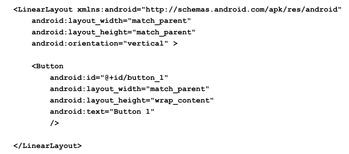

# 第一行代码

##  第一章 安卓介绍

### 1. 安卓系统架构

#### 1.1 Linux 内核层

​	Android 系统是基于内核的，这一层为 Android 设备的各种硬件提供了底层的驱动，如显示驱动、音频驱动、照相机驱动、蓝牙驱动、Wi-Fi 驱动、电源管理等。

#### 1.2 系统运行库层

​	这一层通过一些 C/C++库来为 Android 系统提供了主要的特性支持。如 SQLite 库提
供了数据库的支持，OpenGL|ES 库提供了 3D 绘图的支持，Webkit 库提供了浏览器内核
的支持等。

​	同样在这一层还有 Android 运行时库，它主要提供了一些核心库，能够允许开发者
使用 Java 语言来编写 Android 应用。另外 Android 运行时库中还包含了 Dalvik 虚拟机，
它使得每一个 Android 应用都能运行在独立的进程当中，并且拥有一个自己的 Dalvik 虚
拟机实例。相较于 Java 虚拟机，Dalvik 是专门为移动设备定制的，它针对手机内存、
CPU 性能有限等情况做了优化处理

#### 1.3 应用框架层

​	这一层主要提供了构建应用程序时可能用到的各种 API，Android 自带的一些核心
应用就是使用这些API完成的，开发者也可以通过使用这些API来构建自己的应用程序。

#### 1.4 应用层

​	所有安装在手机上的应用程序都是属于这一层的，比如系统自带的联系人、短信等
程序，或者是你从 Google Play 上下载的小游戏，当然还包括你自己开发的程序。

## 第二章 四大组件之Activity

### 1. activity介绍

	活动是一种可以包含用户界面的组件，主要用于和用户进行交互。

### 2. 活动的基本用法

#### 	2.1 创建活动

​	Android 程序的设计讲究逻辑和视图分离，最好每一个活动都能对应一
个布局，布局就是用来显示界面内容的。

​	编程时创建类继承Acitivity，重写onCreate()方法并在方法中 ==使用setContentView()加载xml布局文件== 作为界面，每一个创建的 ==Activity都需要在Androidmanifest文件中进行声明== 。

###### 						a.创建activity的Java代码

###### 						b.布局文件xml

###### 						c.注册activity

###### 						d.项目目录结构

#### 2.2 隐藏标题栏

在activity的onCreate()方法中的setContentView()之前调requestWindowFeature(Window.FEATURE_NO_TITLE)

#### 2.3 在活动使用Toast

​	Toast 是 Android 系统提供的一种非常好的提醒方式，在程序中可以使用它将一些短小的
信息通知给用户，这些信息会在一段时间后自动消失，并且不会占用任何屏幕空间（次数使用按钮的onclick时来出发Toast）

~~~ java
protected void onCreate(Bundle savedInstanceState) {
	super.onCreate(savedInstanceState);
    // 隐藏标题栏
	requestWindowFeature(Window.FEATURE_NO_TITLE);
    // 设置布局
	setContentView(R.layout.first_layout);
    // 创建按钮
	Button button1 = (Button) findViewById(R.id.button_1);
    // 为按钮绑定事件
	button1.setOnClickListener(new OnClickListener() {
        @Override
        public void onClick(View v) {		// 重写方法 此处为按钮点击后具体的处理逻辑
            Toast.makeText(FirstActivity.this, "You clicked Button 1",
                Toast.LENGTH_SHORT).show(); 
            // 显示Toast，一定要调用show()方法，否则Toast不显示
        }
	});
}
~~~

#### 2.4 在活动中使用menu

首先在res下创建menu文件夹，同activity一样，menu也是使用xml来布局的，只是存放的目录不同而已.

menus文件创建好之后，需要在activity中通过重写onCreateOptionsMenu()方法加载布局，代码如下

~~~ java
@Override
	public boolean onCreateOptionsMenu(Menu menu) {
		// 创建菜单 参数一：菜单文件 参数二：菜单要添加到哪个对象上
		getMenuInflater().inflate(R.menu.main, menu);
		return true;
	}
~~~

#### 2.5 销毁活动

当想要结束当前活动时可以使用activity的finish()方法结束活动。

###### 						点击按钮关闭活动

### 3. 使用intent实现活动之间的跳转与数据传输

#### 3.1 显示intent

> 显示intent就是指定了原activity和目标activity在活动之间跳转

~~~ Java
button1.setOnClickListener(new OnClickListener() {
    @Override
    public void onClick(View v) {
        // 创建activity
        Intent intent = new Intent(FirstActivity.this, SecondActivity.class);
       	// 跳转
        startActivity(intent);
    }
});
~~~

注：使用前需先创建好相应的activity，并==在manifest文件中注册activity==

#### 3.2 隐式intent

> 隐式intent是创建intent时指定intent的action和category，只要action和category与intent都匹配的活动都可以进行跳转

使用前先修改manifest文件中activity，添加action和category

~~~ java
button1.setOnClickListener(new OnClickListener() {
    @Override
    public void onClick(View v) {
        Intent intent = new Intent("com.example.activitytest.ACTION_START");
        // 默认会添加此category
     	// intent.addCategory("android.intent.category.DEFAULT");
       
        // intent.addCategory("com.huae.activitytest.MY_CATEGORY"); 添加自定义category
        startActivity(intent);
    }
});
~~~

**注:**  **1.** intent会默认添加 `android:name="android.intent.category.DEFAULT` 

​       **2.** 可以使用intent通过添加不同的category实现不同程序之间的跳转

​		例：使用intent打开网页 此时能响应该intent的活动必须 action、 category(此处为默认categoriy)、Data同时匹配。

~~~ java
button1.setOnClickListener(new OnClickListener() {
    @Override
    public void onClick(View v) {
        Intent intent = new Intent(Intent.ACTION_VIEW);
        intent.setData(Uri.parse("http://www.baidu.com"));
        startActivity(intent);
    }
});
~~~

#### 3.3 使用intent在activity间传送数据

##### 3.3.1 传递数据给下一个活动

使用intent的putExtra()方法添加数据可以传递个下一个活动、

**传送**

~~~ java
button1.setOnClickListener(new OnClickListener() {
    @Override
    public void onClick(View v) {
        String data = "Hello SecondActivity";
        Intent intent = new Intent(FirstActivity.this, SecondActivity.class);
        intent.putExtra("extra_data", data);
        startActivity(intent);
    }
});
~~~

**接收数据**

##### 3.3.2 返回数据给上一个活动

 ==startActivityForResult()==方法也是用于启动活动的，但这个方法期望在活动销毁的时候能够返回一个结果给上一个活动，startActivityForResult()方法接收两个参数，第一个参数还是 Intent，第二个参数是请求
码，用于在之后的回调中判断数据的来源。

SecondActivity响应数据

FirstActivity数据返回结果

`onActivityResult()`方法带有三个参数，第一个参数 `requestCode`，即我们在启动活动时传
入的请求码。第二个参数` resultCode`，即我们在返回数据时传入的处理结果。第三个参数`data`，
即携带着返回数据的 Intent。由于在一个活动中有可能调用 `startActivityForResult()`方法去启
动很多不同的活动，每一个活动返回的数据都会回调到 `onActivityResult()`这个方法中，因此
我们首先要做的就是通过检查` requestCode` 的值来判断数据来源。确定数据是从SecondActivity 返回的之后，我们再通过 `resultCode` 的值来判断处理结果是否成功。最后从data中取值并打印出来，这样就完成了向上一个活动返回数据的工作。

##### 3.3.3 使用back键返回时 数据返回给上一个活动

只需重写activity的` onBackPressed()`的方法,加入相应的处理逻辑即可

~~~ Java
@Override
public void onBackPressed() {
    Intent intent = new Intent();
    intent.putExtra("data_return", "Hello FirstActivity");
    setResult(RESULT_OK, intent);
    finish();
}
~~~

### 4. 活动的生命周期

#### 4.1 返回栈

>  Android 是使用任务（Task）来管理活动的，一个任务就是一组存放在栈里的活动的集合，这个栈也被称作返回栈（Back Stack）。在默认情况下，每当我们启动了一个新的活动，它会在返回栈中入栈，并处于栈顶的位置。而每当我们按下 Back 键或调用 finish()方法去销毁一个活动时，处于栈顶的活动会出栈，这时前一个入栈的活动就会重新处于栈顶的位置。系统总是会显示处于栈顶的活动给用户。

#### 4.2 活动的状态

每个活动在其生命周期中最多可能会有四种状态。
1. ==运行状态==
    当一个活动位于返回栈的栈顶时，这时活动就处于运行状态。系统最不愿意回收的
    就是处于运行状态的活动，因为这会带来非常差的用户体验。
2. ==暂停状态==
    当一个活动不再处于栈顶位置，但仍然可见时，这时活动就进入了暂停状态。你可
    能会觉得既然活动已经不在栈顶了，还怎么会可见呢？这是因为并不是每一个活动都会
    占满整个屏幕的，比如对话框形式的活动只会占用屏幕中间的部分区域，你很快就会在
    后面看到这种活动。处于暂停状态的活动仍然是完全存活着的，系统也不愿意去回收这
    种活动（因为它还是可见的，回收可见的东西都会在用户体验方面有不好的影响），只
    有在内存极低的情况下，系统才会去考虑回收这种活动。
3. ==停止状态==
    当一个活动不再处于栈顶位置，并且完全不可见的时候，就进入了停止状态。系统
    仍然会为这种活动保存相应的状态和成员变量，但是这并不是完全可靠的，当其他地方
    需要内存时，处于停止状态的活动有可能会被系统回收。
4. ==销毁状态==
    当一个活动从返回栈中移除后就变成了销毁状态。系统会最倾向于回收处于这种状
    态的活动，从而保证手机的内存充足。

#### 4.3 活动的生命周期

###### 									活动生命周期图

Activity 类中定义了七个回调方法，覆盖了活动生命周期的每一个环节。
1. ==onCreate()==
    这个方法你已经看到过很多次了，每个活动中我们都重写了这个方法，它会在活动
    第一次被创建的时候调用。你应该在这个方法中完成活动的初始化操作，比如说加载布
    局、绑定事件等。
2. ==onStart()==
    这个方法在活动由不可见变为可见的时候调用。
3. ==onResume()==
    这个方法在活动准备好和用户进行交互的时候调用。此时的活动一定位于返回栈的
    栈顶，并且处于运行状态。
4. ==onPause()==
    这个方法在系统准备去启动或者恢复另一个活动的时候调用。我们通常会在这个方
    法中将一些消耗 CPU 的资源释放掉，以及保存一些关键数据，但这个方法的执行速度
    一定要快，不然会影响到新的栈顶活动的使用。
5. ==onStop()==
    这个方法在活动完全不可见的时候调用。它和 onPause()方法的主要区别在于，如
    果启动的新活动是一个对话框式的活动，那么 onPause()方法会得到执行，而 onStop()
    方法并不会执行。
6. ==onDestroy()==
    这个方法在活动被销毁之前调用，之后活动的状态将变为销毁状态。
7. ==onRestart()==
    这个方法在活动由停止状态变为运行状态之前调用，也就是活动被重新启动了。

​        以上七个方法中除了 onRestart()方法，其他都是两两相对的，从而又可以将活动分为三
种生存期。

1. 完整生存期
    活动在 onCreate()方法和 onDestroy()方法之间所经历的，就是完整生存期。一般情
    况下，一个活动会在 onCreate()方法中完成各种初始化操作，而在 onDestroy()方法中完
    成释放内存的操作。

2. 可见生存期
    活动在 onStart()方法和 onStop()方法之间所经历的，就是可见生存期。在可见生存
    期内，活动对于用户总是可见的，即便有可能无法和用户进行交互。我们可以通过这两
    个方法，合理地管理那些对用户可见的资源。比如在 onStart()方法中对资源进行加载，
    而在onStop()方法中对资源进行释放，从而保证处于停止状态的活动不会占用过多内存。

3. 前台生存期
    活动在 onResume()方法和 onPause()方法之间所经历的，就是前台生存期。在前台
    生存期内，活动总是处于运行状态的，此时的活动是可以和用户进行相互的，我们平时
    看到和接触最多的也这个状态下的活动。

  ​       **当活动被系统回收时，通过重写`onSaveInstanceState(Bundle outState)`方法保存当前活动中需要保存的一些数据，该方法会在销毁activity之前执行。  然后在activity恢复时通过` onCreate() `方法的参数==savedInstanceState== 获取保存的数据。**

### 5. 活动的启动模式

> 活动的启动模式值得是活动的实例在栈中的存放、创建、销毁。启动模式一共有四种，分别是 `standard`、`singleTop`、`singleTask` 和 `singleInstance`，可 以在 AndroidManifest.xml 中通 过给<activity> 标签 指定android:launchMode属性来选择启动模式

#### 5.1 standard

​	standard 是活动默认的启动模式，在不进行显式指定的情况下，所有活动都会自动使用这种启动模式。==每当启动一个新活动，都会重新创建新活动并放在返回栈的栈顶，不管返回栈栈中是否存在该活动==，资源消耗高。

#### 5.2 singleTop

​	和standard不同的是，==启动新活动是如果栈顶已经是该活动则不创建新活动==，而是直接使用该活动。 缺点：如果活动不再栈顶还是会创建新的活动。

#### 5.3 singleTask

​	解决了上述存在的两种问题==，启动新活动时首先在返回栈中查找是否有该活动的实例，如果有则将该活动以上的所有活动出栈并使用该活==动。缺点：导致活动其他活动提前finish()，影响体验。

#### 5.4 singleInstance

​	`launchMode`指定为singleInstance的活动会放在一个单独的栈中，可供多个应用程序共享。

## 第三章 常用UI组件与布局

### 3.1 常用控件使用方法

#### 3.1.1 TextView

> 用于在界面显示一段文本 常用属性如下：

~~~xml
<TextView 
    android:id="@+id/text_view"  指定id，用于定位控件、在代码中执行相关操作
    android:layout_width="match_parent" 可选:match_parent、fill_parent 和 wrap_content
    android:layout_height="wrap_content"  同上
    android:text="This is TextView"		设置显示的文本
    android:gravity="center" 		设置控件内文本的对齐方式
    android:textSize="24sp"			字体大小
    android:textColor="#00ff00" 	文字颜色/>
~~~

 #### 3.1.2 Button

> 显示按钮，Button继承自TextView。 可设置点击事件

~~~ xml
<Button 
    android:id="@+id/button" 
    android:layout_width="match_parent" 
    android:layout_height="wrap_content" 
    android:text="Button" /> 
~~~

==添加点击事件的四种方式：==

* 匿名内部内(OnClickListener)

  ~~~Java
  public class MainActivity extends Activity{
      private Button button;
      
      @Overrid
      public void onCreate(Bundle savedInstanceState){
          super.onCreate(savedInstanceState);
          setContentView(R.layout.activity_main);
          button = (Button) findViewById(R.id.button);
          button.setOnClickListener(new OnClickListener() { 
          	@Override
              public void onClick(View v) { 
                  // 在此处添加逻辑
              }
          });
      }
  }
  ~~~

* activity实现OnClickListener接口,重写onClick方法

* 在xml中声明，在Java代码中实现

  ~~~xml
  <LinearLayout xmlns:android="http://schemas.android.com/apk/res/android"
      xmlns:tools="http://schemas.android.com/tools"
      android:layout_width="match_parent"
      android:layout_height="match_parent"
      tools:context="com.example.button.MainActivity" >
   
      <Button
          android:onClick="btn"
          android:layout_width="wrap_content"
          android:layout_height="wrap_content"
          android:text="按钮" />
   
  </LinearLayout>
  ~~~

  ~~~Java
  
  //在相应activity建立对应的方法
  //定义与XML种OnClick属性名字对应的方法 注意在方法参数种加上 View v
  public void btn(View v) {
      Toast.makeText(MainActivity.this, "设置Onclick属性", 	                           Toast.LENGTH_SHORT).show();
  }
  ~~~

* 编写内部类实现OnClickListener接口

  ~~~Java
  private class MyListener implements OnClickListener{
   
  		@Override
  		public void onClick(View v) {
  			// TODO Auto-generated method stub
  			callPhone();
  		}
  		
  	}
  // 然后通过setOnClickListener给相应的按钮事件，参数为自定义类的实例
  ~~~

#### 3.1.3 EditText

> EditText是程序用于和用户进行交互的另一个重要控件，它允许用户在控件里输入和编 辑内容，并可以在程序中对这些内容进行处理

~~~xml
<LinearLayout xmlns:android="http://schemas.android.com/apk/res/android"
    android:layout_width="match_parent" 
    android:layout_height="match_parent" 
    android:orientation="vertical" >
	……
    <EditText 
        android:id="@+id/edit_text"
        android:hint="Type something here" 设置输入框的提示文本
        android:maxLines="2" 最大显示行数，超出文本自动滚动
        android:layout_width="match_parent" 
        android:layout_height="wrap_content" />
</LinearLayout>

<!-- 更多属性请查看文档-->
~~~

* 示例

  Button与EditText结合使用，实现点击Button显示EditText中的文本

  ~~~xml
  <!--布局文件-->	
  <LinearLayout xmlns:android="http://schemas.android.com/apk/res/android" 
  	android:layout_width="match_parent" 
  	android:layout_height="match_parent" 
  	android:orientation="vertical" >
  	……
  	<EditText 
  		android:id="@+id/edit_text" 
  		android:layout_width="match_parent" 
  		android:layout_height="wrap_content"
  		android:hint="Type something here" 
  		android:maxLines="2" /> 
  </LinearLayout>
  ~~~

  ~~~java
  // java代码
  public class MainActivity extends Activity implements OnClickListener { 
  	private Button button; 
  	private EditText editText; 
  	
  	@Override 
  	protected void onCreate(Bundle savedInstanceState) { 
  		super.onCreate(savedInstanceState); 
  		setContentView(R.layout.activity_main); 
  		button = (Button) findViewById(R.id.button);
  		editText = (EditText) findViewById(R.id.edit_text); 
  		button.setOnClickListener(this);
  	} 
  
  	@Override 
  	public void onClick(View v) { 
  		switch (v.getId()) { 
  		case R.id.button: 
  			String inputText = editText.getText().toString(); 
  			Toast.makeText(MainActivity.this, inputText, Toast.LENGTH_SHORT).show(); 
  			break; 
  		default: 
  			break; 
  		} 
  	} 
  }
  ~~~

==下面只演示用法，控件具体属性查看相关文档==

#### 3.1.4 ImageView

> ImageView是用于在界面上展示图片的一个控件，通过它可以让我们的程序界面变得更加 丰富多彩

* 示例：点击按钮，切换图片

~~~xml
<!--布局文件-->
<LinearLayout xmlns:android="http://schemas.android.com/apk/res/android" 
	android:layout_width="match_parent" 
	android:layout_height="match_parent" 
	android:orientation="vertical" >
	……
	<ImageView 
		android:id="@+id/image_view" 
		android:layout_width="wrap_content" 
		android:layout_height="wrap_content" 
		android:src="@drawable/ic_launcher" /> 
    <Button
        android:onClick="Button"
        android:layout_width="wrap_content"
        android:layout_height="wrap_content"
        android:text="切换图片" />
</LinearLayout> 
~~~

~~~java
// Java代码
public class MainActivity extends Activity implements OnClickListener { 
	private Button button; 
	private ImageView imageView;
  
    @Override
    protected void onCreate(Bundle savedInstanceState) { 
	    super.onCreate(savedInstanceState); 
	    setContentView(R.layout.activity_main); 
	    button = (Button) findViewById(R.id.button); 
	    imageView = (ImageView) findViewById(R.id.image_view); 
	    button.setOnClickListener(this); 
	} 
   
   @Override 
   public void onClick(View v) { 
   	switch (v.getId()) {
    case R.id.button: 
	   	imageView.setImageResource(R.drawable.jelly_bean); 
	    break; 
    default:
    	break; 
    } 
  } 
} 
~~~

#### 3.1.5 ProgressBar

> ProgressBar用于在界面上显示一个进度条，表示我们的程序正在加载一些数据

~~~xml
<LinearLayout xmlns:android="http://schemas.android.com/apk/res/android" 
	android:layout_width="match_parent" 
	android:layout_height="match_parent" 
	android:orientation="vertical" >
	……
	<ProgressBar 
		android:id="@+id/progress_bar" 
		android:layout_width="match_parent" 
		android:layout_height="wrap_content" /> 
</LinearLayout> 

<!--额外属性 (水平情况下)
    style="?android:attr/progressBarStyleHorizontal" 进度条水平
    android:max="100"  最大进度
    android:progress="50" 设置初始进度  
-->
~~~

* 默认ProgressBar是圆形的，可通过`style="?android:attr/progressBarStyleHorizontal"`属性设置为水平进度条。 

* 通过visible属性设置进度条的可见性，特定情况下提升用户体验 ；

* Java代码中通过控件的==setVisible==方法控制控件显示与隐藏，可以传入 View.VISIBLE、View.INVISIBLE和 View.GONE三种值。

  ~~~xml
  <ProgressBar 
  		android:id="@+id/progress_bar" 
          android:visible="visible" 可选值：visible、invisible(不可见，占据位置)和 gone（不可见，不占据位置）
  		android:layout_width="match_parent" 
  		android:layout_height="wrap_content" /> 
  ~~~

#### 3.1.6 AlertDialog

> AlertDialog可以在当前的界面弹出一个对话框，这个对话框是置顶于所有界面元素之上 的，能够屏蔽掉其他控件的交互能力，因此一般 AlertDialog都是用于提示一些非常重要的 内容或者警告信息。

~~~java
// Java代码点击按钮弹出对话框
public class MainActivity extends Activity implements OnClickListener {
	…… 
	@Override 
    public void onClick(View v) { 
		switch (v.getId()) { 
		case R.id.button: 
			AlertDialog.Builder dialog = new AlertDialog.Builder (MainActivity.this); 
			dialog.setTitle("This is Dialog"); 
			dialog.setMessage("Something important."); d
			ialog.setCancelable(false); 
			dialog.setPositiveButton("OK", new DialogInterface. OnClickListener() {

				@Override 
				public void onClick(DialogInterface dialog, int which) { 
				}
			}); 
			dialog.setNegativeButton("Cancel", new DialogInterface. OnClickListener() { 
			
			@Override 
			public void onClick(DialogInterface dialog, int which) { 
				} 
			}); 
			dialog.show(); 
			break; 
		default:
			break; 
			
			} 
		}	 
} 
~~~

首先通过 AlertDialog.Builder创建出一个 AlertDialog的实例，然后可以为这个对话框设 置标题、内容、可否取消等属性，接下来调用 setPositiveButton()方法为对话框设置确定按钮 的点击事件，调用 setNegativeButton()方法设置取消按钮的点击事件，最后调用 show()方法 将对话框显示出来。

#### 3.1.7 ProgressDialog

> ProgressDialog和 AlertDialog有点类似，都可以在界面上弹出一个对话框，都能够屏蔽 掉其他控件的交互能力。不同的是，ProgressDialog会在对话框中显示一个进度条，一般是 用于表示当前操作比较耗时，让用户耐心地等待。

可以看到，这里也是先构建出一个 ProgressDialog对象，然后同样可以设置标题、内容、 可否取消等属性，最后也是通过调用 show()方法将 ProgressDialog显示出来。

==注意==：如果在 setCancelable()中传入了 false，表示 ProgressDialog是不能通过 Back键取消 掉的，这时你就一定要在代码中做好控制，当数据加载完成后必须要调用 ProgressDialog的 dismiss()方法来关闭对话框，否则 ProgressDialog将会一直存在。

### 3.2 四大基本布局

一个丰富的界面总是要由很多个控件组成的，那我们如何才能让各个控件都有条不紊地 摆放在界面上，而不是乱糟糟的呢？这就需要借助布局来实现了。布局是一种可用于放置很 多控件(控件和布局)的容器，它可以按照一定的规律调整内部控件的位置。

###### 										布局与控件的关系

#### 3.3.1 LinearLayout

> LinearLayout又称作线性布局，是一种非常常用的布局。正如它名字所描述的一样，这 个布局会将它所包含的控件在==线性方向(垂直或水平)==上依次排列。

~~~xml
<LinearLayout xmlns:android="http://schemas.android.com/apk/res/android"
	android:layout_width="match_parent" 
	android:layout_height="match_parent"
	android:orientation="vertical" >   可选值:horizontal(默认)、vertical,此处设置控件排列方向为垂直
</LinearLayout>

<!--
 android:layout_gravity="xxx" 控件相对父布局的对齐方式
 android:gravity="xxx" 控件内内容的对齐方式

 android:layout_weight="" 权重值
-->
~~~

#### 3.3.2 RelativeLayout

> RelativeLayout又称作相对布局，也是一种非常常用的布局。和 LinearLayout的排列规 则不同，RelativeLayout显得更加随意一些，它可以通过相对定位的方式让控件出现在布局 的任何位置。

~~~xml
<RelativeLayout xmlns:android="http://schemas.android.com/apk/res/android" 
android:layout_width="match_parent" 
android:layout_height="match_parent" > 
	<Button 
		android:id="@+id/button1" 
		android:layout_width="wrap_content" 
		android:layout_height="wrap_content"
		android:layout_alignParentLeft="true" 
		android:layout_alignParentTop="true" 
		android:text="Button 1" /> 
	<Button 
		android:id="@+id/button2" 
		android:layout_width="wrap_content"
		android:layout_height="wrap_content" 
		android:layout_alignParentRight="true" 
		android:layout_alignParentTop="true" 
		android:text="Button 2" /> 
	<Button 
		android:id="@+id/button3" 
		android:layout_width="wrap_content" 
		android:layout_height="wrap_content" 
		android:layout_centerInParent="true" 
		android:text="Button 3" /> 
	<Button 
		android:id="@+id/button4" 
		android:layout_width="wrap_content" 
		android:layout_height="wrap_content" 
		android:layout_alignParentBottom="true"
		android:layout_alignParentLeft="true"
		android:text="Button 4" /> 
	<Button 
		android:id="@+id/button5" 
		android:layout_width="wrap_content" 
		android:layout_height="wrap_content" 
		android:layout_alignParentBottom="true" 
		android:layout_alignParentRight="true" 
		android:text="Button 5" /> 
</RelativeLayout>
~~~

结果：

==android:layout_alignParentxxx=“xxx”==：相对父控件对齐

==android:layout_xxx="@id/button3" 与联合android:layout_toxxxOf="@id/button3"使用==:相对特定控件对齐 

#### 3.3.3 FrameLayout

> FrameLayout相比于前面两种布局就简单太多了，因此它的应用场景也少了很多。这种 布局没有任何的定位方式，所有的控件都会摆放在布局的左上角。

~~~xml
<FrameLayout xmlns:android="http://schemas.android.com/apk/res/android" 
android:layout_width="match_parent" 
android:layout_height="match_parent" > 
	<Button 
		android:id="@+id/button" 
		android:layout_width="wrap_content" 
		android:layout_height="wrap_content" 
		android:text="Button" /> 
	<ImageView 
		android:id="@+id/image_view" 
		android:layout_width="wrap_content" 
		android:layout_height="wrap_content" 
		android:src="@drawable/ic_launcher" /> 
</FrameLayout> 
~~~

结果：

#### 3.3.4 TableLayout

> TableLayout允许我们使用表格的方式来排列控件

~~~xml
<TableLayout xmlns:android="http://schemas.android.com/apk/res/android" 
	android:layout_width="match_parent" 
	android:layout_height="match_parent"
    android:stretchColumns="1" >  第二列可以自动拉伸

	<TableRow> 
		<TextView 
		android:layout_height="wrap_content" 
		android:text="Account:" /> 
		<EditText 
		android:id="@+id/account" 
		android:layout_height="wrap_content" 
		android:hint="Input your account" /> 
	</TableRow> 

	<TableRow> 
		<TextView 
		android:layout_height="wrap_content" 
		android:text="Password:" /> 
		<EditText 
		android:id="@+id/password" 
		android:layout_height="wrap_content" 
		android:inputType="textPassword" /> 
	</TableRow> 

	<TableRow> 
		<Button 
		android:id="@+id/login" 
		android:layout_height="wrap_content" 
		android:layout_span="2" 
		android:text="Login" /> 
	</TableRow> 
	
</TableLayout>
<!--
android:layout_span="2" 让某一列占据两格的空间（合并单元格）
android:stretchColumns="x" 设置某一列可以拉伸，以达到自动适应屏幕宽度的作用
-->
~~~

结果 ：

==注==: AbsoluteLayout绝对布局已不推荐使用。。。。。。。

### 3.3 简单创建自定义控件

> 通过控件组合创建自己需要的控件，并可复用该控件

步骤：

1. 创建控件的xml布局文件

2. 在需要的地方使用include标签引入该布局文件(响应事件不方便)

3. 新建类==继承相应的布局或控件类或者之间继承View类==,在新类的构造函数中使用`LayoutInflater`动态加载布局

   ~~~java
   public class TitleLayout extends LinearLayout { 
   	public TitleLayout(Context context, AttributeSet attrs) { 
   		super(context, attrs); 
   		LayoutInflater.from(context).inflate(R.layout.title, this); 
   	} 
   }
   ~~~

   此时在布局文件中需要使用完整类名引入该布局:

   ~~~xml
   <LinearLayout xmlns:android="http://schemas.android.com/apk/res/android" 
   	android:layout_width="match_parent" 
   	android:layout_height="match_parent" > 
   	
   	<com.example.uicustomviews.TitleLayout   引入布局
   		android:layout_width="match_parent" 
   		android:layout_height="wrap_content" >
   	</com.example.uicustomviews.TitleLayout> 
   </LinearLayout> 
   ~~~

4. 在新类中根据需要为响应控件添加相应事件

   ~~~java
   public class TitleLayout extends LinearLayout { 
   	public TitleLayout(Context context, AttributeSet attrs) { 
   		super(context, attrs); 
   			LayoutInflater.from(context).inflate(R.layout.title, this); 
   			Button titleBack = (Button) findViewById(R.id.title_back); 
   			Button titleEdit = (Button) findViewById(R.id.title_edit); 
   			// 添加点击事件
   			titleBack.setOnClickListener(new OnClickListener() { 
   			
   			@Override 
   			public void onClick(View v) { 
   				((Activity) getContext()).finish(); 
   			} 
   		}); 
           	// 添加点击事件
   			titleEdit.setOnClickListener(new OnClickListener() {
   			
   			@Override
   			public void onClick(View v) { 
   				Toast.makeText(getContext(), "You clicked Edit button", Toast.LENGTH_SHORT).show(); 
   			}
   		});
   	}
   }
   ~~~

### 3.4 ListView的使用与自定义ListView

#### 3.4.1 ListView的简单使用

~~~xml
<LinearLayout xmlns:android="http://schemas.android.com/apk/res/android" 
	android:layout_width="match_parent" 
	android:layout_height="match_parent" > 
	
	<ListView 
		android:id="@+id/list_view" 
        android:entries="@array/ctype" 指定ListView的资源，本方式需要在values中创建资源文件
		android:layout_width="match_parent" 
		android:layout_height="match_parent" > 
	</ListView> 
</LinearLayout>
~~~

资源文件arrays.xml

~~~xml
<resources>
	<string-array name="ctype">
    	<item>xxx</item>
        	...
        <item>xxx</item>
    </string-array>
</resources>
~~~

或者==在Java代码中通过适配器adapter为ListView设置资源==

~~~java
public class MainActivity extends Activity {
    private String[] data = { "Apple", "Banana", "Orange","Watermelon", "Pear", "Grape", "Pineapple", "Strawberry","Cherry", "Mango" };
    
    @Override
    protected void onCreate(Bundle savedInstanceState) {
        super.onCreate(savedInstanceState);
        setContentView(R.layout.activity_main);
        // 创建适配器 android.R.layout.simple_list_item_1 ListView每一项布局
        ArrayAdapter<String> adapter = new ArrayAdapter<String>(
            MainActivity.this, android.R.layout.simple_list_item_1,data);
        ListView listView = (ListView) findViewById(R.id.list_view);
        listView.setAdapter(adapter);
    }
}
~~~

#### 3.4.2 定制ListView

只能显示一段文本的 ListView实在是太单调了，我们现在就来对 ListView的界面进行定制，让它可以显示更加丰富的内容。

步骤：

1.  编写实体类，对应ListView每一项显示的数据，作为适配器的适配类型

   ~~~java
   package com.example.listviewtest.bean;
   
   public class Fruit {
   	private String fruitName;
   	private int imageId;
   	
   	public Fruit(String fruitName, int imageId) {
   		this.fruitName = fruitName;
   		this.imageId = imageId;
   	}
   	public String getFruitName() {
   		return fruitName;
   	}
   	public void setFruitName(String fruitName) {
   		this.fruitName = fruitName;
   	}
   	public int getImageId() {
   		return imageId;
   	}
   	public void setImageId(int imageId) {
   		this.imageId = imageId;
   	}
   }
   
   ~~~

2. 创建ListView子项布局，即LsitView每一项的布局

   ~~~xml
   <?xml version="1.0" encoding="utf-8"?>
   <LinearLayout xmlns:android="http://schemas.android.com/apk/res/android"
       android:layout_width="match_parent"
       android:layout_height="wrap_content"
       android:orientation="horizontal" >
       
       <ImageView 
           android:id="@+id/fruit_image"
           android:layout_width="wrap_content"
           android:layout_height="wrap_content"
           android:layout_gravity="center"
           android:src="@drawable/ic_launcher"/>
   	<TextView 
   	    android:id="@+id/fruit_name"
   	    android:layout_width="wrap_content"
   	    android:layout_height="wrap_content"
   	    android:layout_marginLeft="10dp"
   	    android:layout_gravity="center_vertical"
   	    android:text="jjjjjjjjjjjjj"/>
   </LinearLayout>
   ~~~

3. 创建自定义适配器类

   ~~~java
   package com.example.listviewtest;
   
   import java.util.List;
   
   import android.content.Context;
   import android.view.LayoutInflater;
   import android.view.View;
   import android.view.ViewGroup;
   import android.widget.ArrayAdapter;
   import android.widget.ImageView;
   import android.widget.TextView;
   
   import com.example.listviewtest.bean.Fruit;
   
   public class FruitAdapter extends ArrayAdapter<Fruit> {
   
   	private int resourceId;
   
   	public FruitAdapter(Context context, int textViewResourceId,
   			List<Fruit> objects) {
   		super(context, textViewResourceId, objects);
   		// 获取布局
   		resourceId = textViewResourceId;
   	}
   
   	@Override
   	public View getView(int position, View convertView, ViewGroup parent) {
   		// 获取对应数据项
   		Fruit item = getItem(position);
   		// 加载布局
   		View view;
   		ViewHolder viewHolder;
   		// 1. 解决每次getView是都重新加载view 提升效率
   		if (convertView == null) {
   			view = LayoutInflater.from(getContext()).inflate(resourceId, null);
   
   			// 缓存实例 提升效率
   			viewHolder = new ViewHolder();
   			viewHolder.fruitImage = (ImageView) view
   					.findViewById(R.id.fruit_image);
   			viewHolder.fruitName = (TextView) view
   					.findViewById(R.id.fruit_name);
   
   			view.setTag(viewHolder);
   		} else {
   			view = convertView;
   			viewHolder = (ViewHolder) view.getTag();
   		}
   
   		// View view = LayoutInflater.from(getContext()).inflate(resourceId,
   		// parent);
   		// java.lang.UnsupportedOperationException: addView(View, LayoutParams)
   		// is not supported in AdapterView
   
   		// 设置数据
   		/*
   		 * ImageView fruitImage = (ImageView)
   		 * view.findViewById(R.id.fruit_image);
   		 * fruitImage.setImageResource(item.getImageId());
   		 * 
   		 * TextView fruitName = (TextView) view.findViewById(R.id.fruit_name);
   		 * fruitName.setText(item.getFruitName());
   		 */
   
   		viewHolder.fruitImage.setImageResource(item.getImageId());
   		viewHolder.fruitName.setText(item.getFruitName());
   		return view;
   	}
   
   	// 2. 保存findViewById的实例 提升效率
   	class ViewHolder {
   		ImageView fruitImage;
   		TextView fruitName;
   	}
   }
   
   ~~~

4. 创建资源文件，用资源文件创建适配器，为ListView设置适配器

   ~~~java
   	package com.example.listviewtest;
   
   import java.util.ArrayList;
   
   import com.example.listviewtest.bean.Fruit;
   
   import android.app.Activity;
   import android.app.AlertDialog;
   import android.content.DialogInterface;
   import android.os.Bundle;
   import android.view.Menu;
   import android.view.View;
   import android.widget.AdapterView;
   import android.widget.ArrayAdapter;
   import android.widget.ListView;
   
   public class MainActivity extends Activity {
   	private ListView listView;
   	private ArrayList<Fruit> fruitist = new ArrayList<Fruit>();
   
   	@Override
   	protected void onCreate(Bundle savedInstanceState) {
   		super.onCreate(savedInstanceState);
   		setContentView(R.layout.activity_main);
   
   		listView = (ListView) findViewById(R.id.list_view);
   		initFruits();
   
   		// 简单ListView 每行只有一个文本
   		// simpleListView();
   
   		// 复杂的ListView 显示图片和文本
   		complexListView(listView);
   		// 设置点击事件
   		listView.setOnItemClickListener(new AdapterView.OnItemClickListener() {
   
   			@Override
   			public void onItemClick(AdapterView<?> parent, View view,
   					int position, long id) {
   				Fruit fruit = fruitist.get(position);
   				new AlertDialog.Builder(MainActivity.this)
   						.setTitle("详情")
   						.setMessage(
   								"你点击了'" + fruit.getFruitName() + "'  id"
   										+ fruit.getImageId())
   						.setPositiveButton("确定",
   								new DialogInterface.OnClickListener() {
   
   									@Override
   									public void onClick(DialogInterface dialog,
   											int which) {
   
   									}
   								}).show();
   			}
   		});
   	}
   
   	private void complexListView(ListView listView) {
   		FruitAdapter adapter = new FruitAdapter(MainActivity.this,
   				R.layout.fruit_layout, fruitist);
   		listView.setAdapter(adapter);
   	}
   
   	private void initFruits() {
   		fruitist.add(new Fruit("apple", R.drawable.apple_pic));
   		fruitist.add(new Fruit("banana", R.drawable.banana_pic));
   		fruitist.add(new Fruit("cherry", R.drawable.cherry_pic));
   		fruitist.add(new Fruit("grape", R.drawable.grape_pic));
   		fruitist.add(new Fruit("mango", R.drawable.mango_pic));
   		fruitist.add(new Fruit("orange", R.drawable.orange_pic));
   		fruitist.add(new Fruit("pear", R.drawable.pear_pic));
   		fruitist.add(new Fruit("pineapple", R.drawable.pineapple_pic));
   		fruitist.add(new Fruit("strawberry", R.drawable.strawberry_pic));
   		fruitist.add(new Fruit("watermelon", R.drawable.watermelon_pic));
   		...
   	}
   
   	private void simpleListView() {
   		// 准备数据
   		String[] data = { "Apple", "Banana", "Orange", "Watermelon", "Pear",
   				"Grape", "Pineapple", "Strawberry", "Cherry", "Mango", "Apple",
   				"Banana", "Orange", "Watermelon", "Pear", "Grape", "Pineapple",
   				"Strawberry", "Cherry", "Mango" };
   		// 创建适配器 指定listView的上下文、每一项(行)的布局和内容
   		ArrayAdapter<String> adapter = new ArrayAdapter<String>(
   				MainActivity.this, android.R.layout.simple_list_item_1, data);
   		listView.setAdapter(adapter);
   	}
   }
   
   ~~~

5. 为ListView设置相应事件

#### 3.4.3  单位和尺寸

​	在编写 Android程序的时候，尽量将控件或布局的大小指定成 match_parent 或 wrap_content，如果必须要指定一个固定值，则使用 dp来作为单位，指定文字大小的时候 使用 sp作为单位。

### 3.5 制作 Nine-Patch图片

当图片大小不能满足控件大小时，图片被均匀拉伸，不美观，可以使用 Nine-Patch做特殊处理。

如图所示，当图片需要拉伸时，只会拉伸红色矩形范围的图片，不会造成图片不美观的结果。

## 第四章 碎片Fragment的使用

### 4.1 碎片是什么

### 4.2 碎片的使用方式

### 4.3 碎片的生命周期

### 4.4 动态加载布局的技巧

### 4.5 碎片实践

